layout: true
    
<div class="logo"></div> 


```{r setup, include=FALSE}
# Here you can place global options for the entire document.
# Mostly used for knitr settings, but can also load data etc.
# Whatever happens here will not show in the presentation.
knitr::opts_chunk$set(fig.retina = 3, 
                      warning = FALSE, 
                      message = FALSE,
                      echo = TRUE)

# dir("../img", recursive = T, full.names = T) %>%
#   walk(~{file.copy(.x, str_remove(.x, "\\.\\.\\/"))})
```

---

## Overview


**1. Examining microtargeting in the German election**

<br>

**2. Studying the blackbox of the Facebook algorithm**

---

## Political Microtargeting


> Personalizing political campaign messages based on large-scale data collection

--

Most commonly known examples: 

+ Cambridge Analytics
+ Russian based troll farm: IRA

.pull-left[


]

.pull-right[


]

---


class: center, middle

## Targeting during German Bundestag elections

### Collaboration with Who Targets Me

---

class: white

## Who Targets Me

.pull-left[


]

.pull-right[

]

---

class: white

### Who Targets Me


.pull-left[

+ ZDF Magazin Royale collaborates with Who Targets Me (April 2021)

+ 17k users in Germany sign up with WTM in the next months

+ only ~5k users (~30%) see ads

+ 150k political ad impressions

+ I join the project end of July 2021

]

.pull-right[


]


---

class: white

### ZDF Magazine Royale Show 24. September 2021


http://y2u.be/8vq6MzGNZyM

---


class: white

## Political Advertisers in Germany

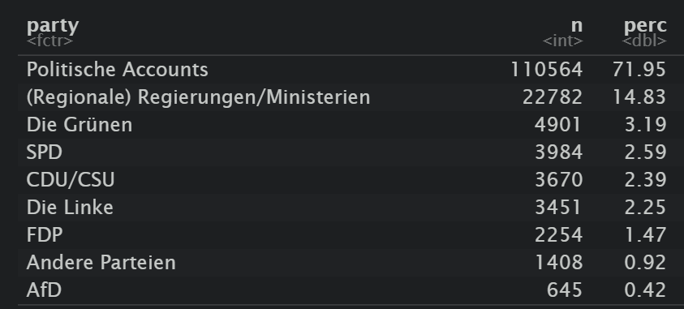

---


class: white

## Political Advertisers in Germany


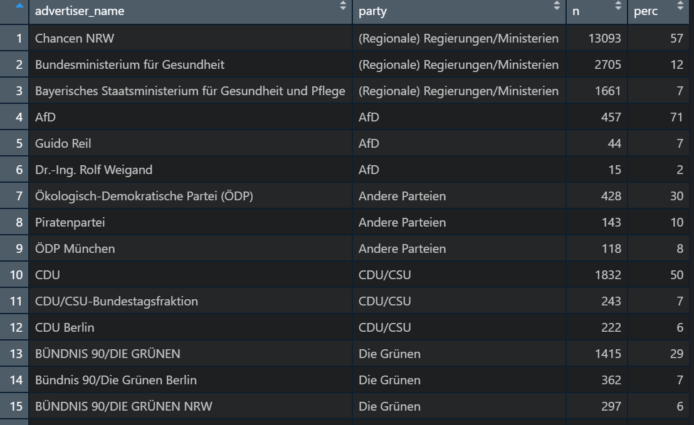


---


class: white

## Political Advertisers in Germany

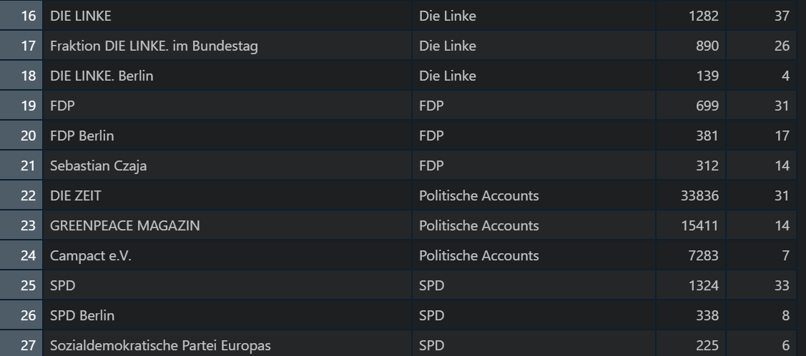

---

class: white

## Bias in data - Gender

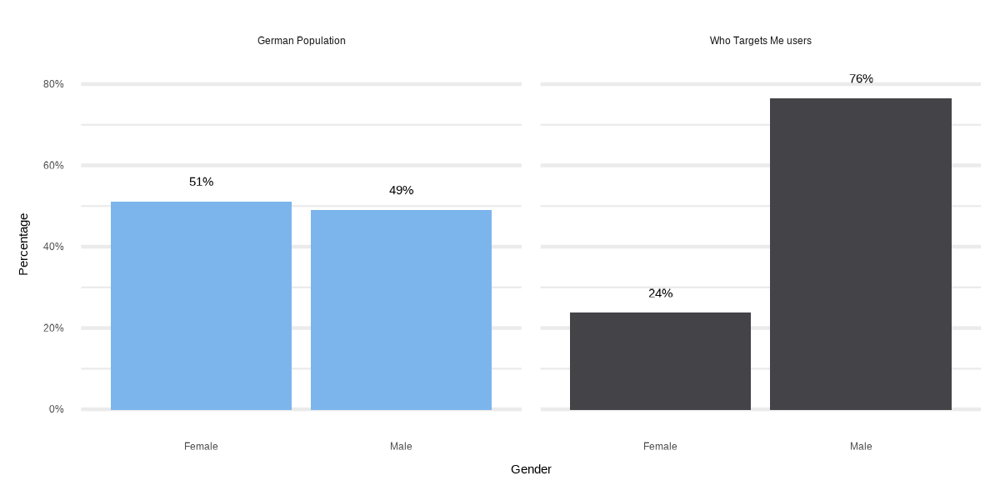


---

class: white

## Bias in data - Age


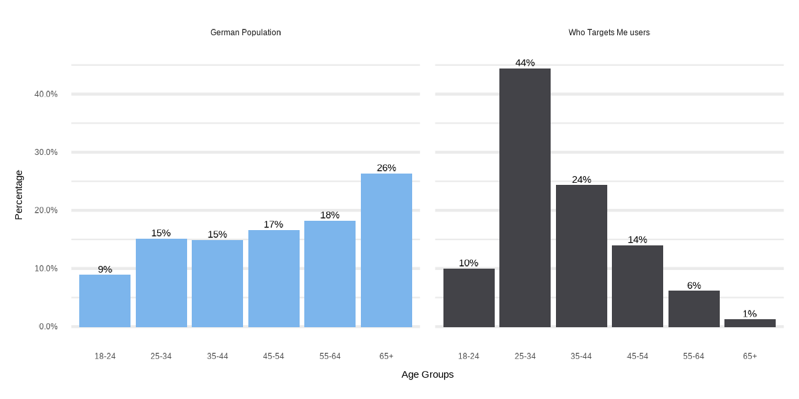

---

class: white

## Bias in data - Bundesland


---

class: white

### Weighting the data 

#### according to German population metrics


---

class: white

## Why Am I Seeing This

+  WTM users share the text from the ‘Why am I seeing this?’ label


---

class: white

### Which targeting criteria did German parties use?

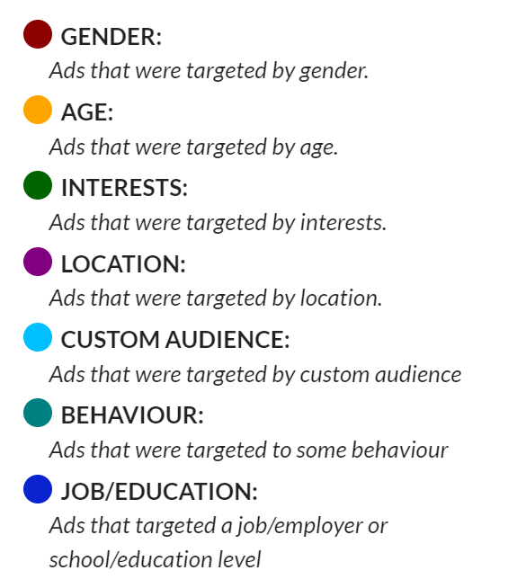

---

class: white

### How common is targeting anyway?


---

class: white

### Which targeting criteria did German parties use?

+ Parties often target interest in their own party

+ Parties often use location targeting

+ Parties make frequent use of custom and lookalike audiences

Link to Shiny app to explore results:

[favstats.shinyapps.io/btw21_wtm/](https://favstats.shinyapps.io/btw21_wtm/)

---

class: white

### Targeting - CDU/CSU

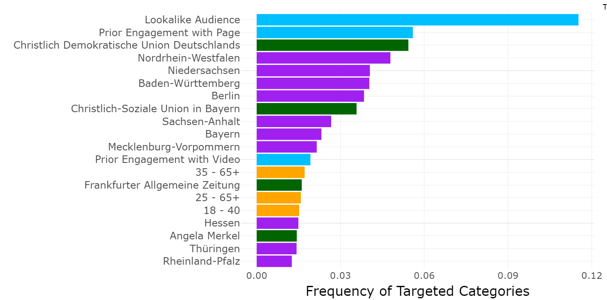

---

class: white

### Targeting - SPD

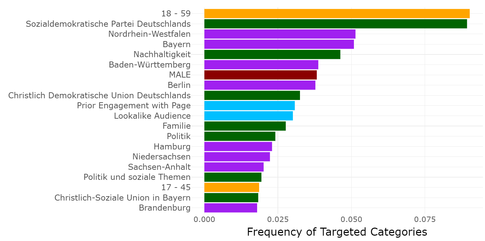


---


class: white

### Targeting - Die Grünen

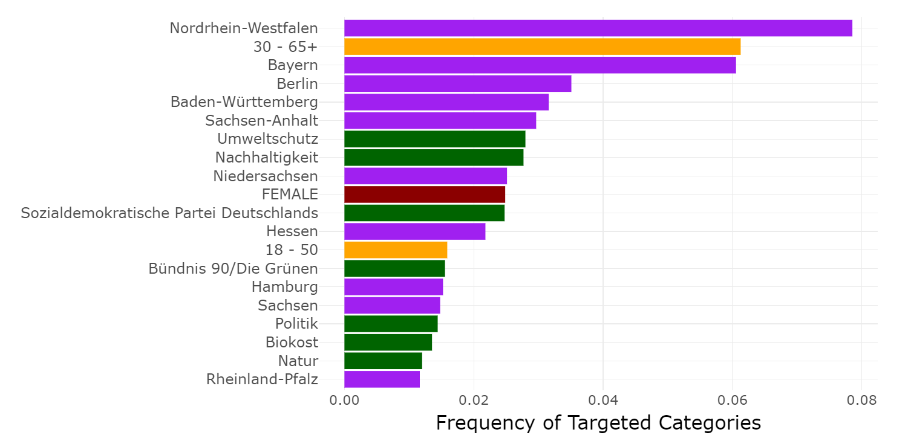


---

class: white

### Targeting - AfD

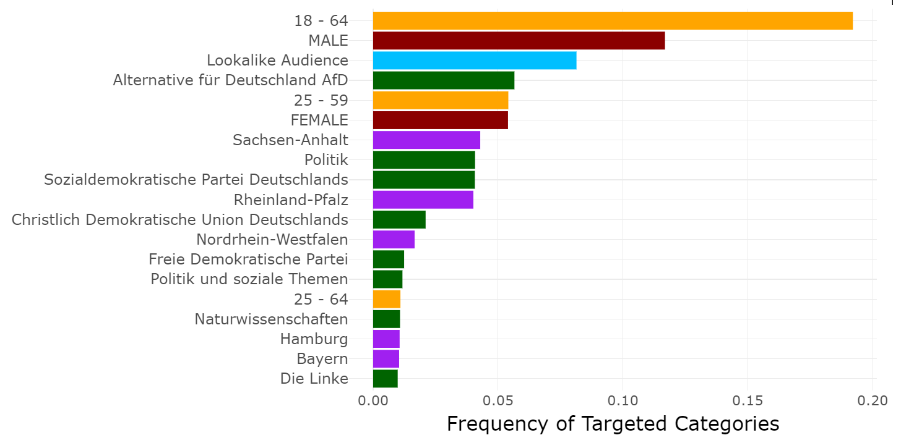


---

class: white

### Targeting - LINKE

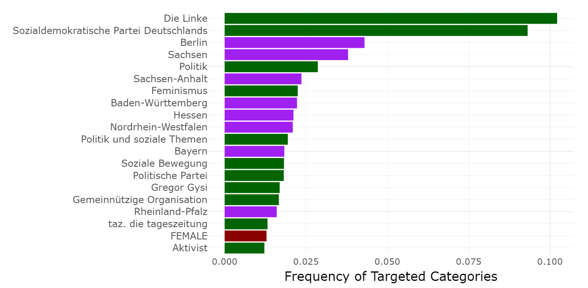

---

class: white

### Targeting - FDP

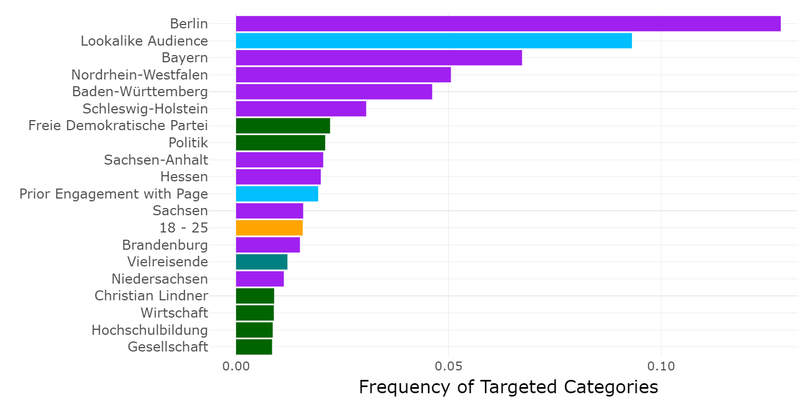

---

class: white

### Targeting Networks - CDU


---

class: white

### Targeting vaccine skeptic content

.pull-left[


]

.pull-right[

]

---

class: white

### Targeting vaccine skeptic content

.pull-left[


]


.pull-right[
> Ich selbst bin weder ein fanatischer Impfgegner noch -Befürworter: Weil die Haupterfolge gegen dieses Virus sowieso in unseren Immunsystemen stattfinden, wenn sie – von Stress und Umweltschäden verschont – Keime abwehren und ein unauffälliges Infektionsgeschehen bewirken.
]


---

class: white

## Attack Ads - CDU

.pull-left[
This CDU ad is targeted at 

+ small business owners
+ interest in business management
+ female entrepreneurs
+ start-ups
+ “The Economist” 
+ entrepreneurship
]

.pull-right[


]


---

class: white

## Targeting opponents - GRÜNEN

Ads targeted at older people (30-65+), interest in SPD, and also various environmentalist interests (ecology, sustainability, etc.)


---

## What work remains to be done?

+ A lot

--

+ Everything in regards to content of the ads

+ Issue Ownership 

+ How are negative ads targeted? 

+ To which degree are ads personalized? 

+ How common is “two-facedness”, promising different things to different voters? 

---

class: center, middle

## Automated Microtargeting

### Exploring the Influence of the Facebook Ad Delivery Algorithm in the Dutch Context

---

## Ad Delivery Algorithms


+ Discourse on political microtargeting is often focused on the "bad actor" story

  + Russian election interference campaign (IRA)
  
  + Cambridge Analytica
  
  + Trump campaign (Steve Bannon, Brad Parscale)

--

<br>

+ The explicit assumption here is that the advertisers have strong control over who sees which ad

--

<br>

There is a distinct lack of research on the *automated* aspect of political microtargeting: 

the **ad delivery algorithm**

---


class: center, middle

## Poltical Microtargeting since 2016

--

Ad libraries and **limitations to targeting**


---

### Poltical Microtargeting since 2016

**Google** now only allows targeting by age, gender and location for political ads.

**Facebook** also limited ad targeting options 
  + disallowing targeting based on race, religion and more
  
--
  
.pull-left[
```{r, out.width="160%", echo = F}
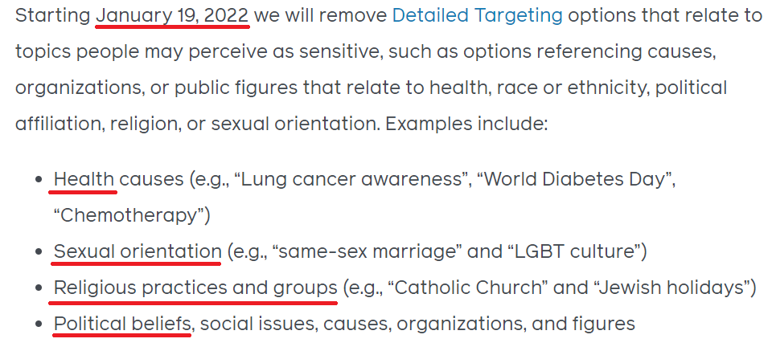
```
]

.pull-right[
<br>
<br>
<br>
[facebook.com/business/news/removing-certain-ad-targeting-options-and-expanding-our-ad-controls](https://www.facebook.com/business/news/removing-certain-ad-targeting-options-and-expanding-our-ad-controls)
]


---


### Poltical Microtargeting since 2016

**Google** now only allows targeting by age, gender and location for political ads.

**Facebook** also limited ad targeting options 
  + disallowing targeting based on race, religion and more
  
<br>

Facebook still allows targeting based on:
  + detailed demographics 
  + users' declared interests 
  + Behavioural targeting 
  + Custom and Lookalike Audiences


---


class: center, middle

# Ad Objectives,<br>Optimizations<br>and Relevancy

---

### Ad Objectives, Optimizations and Relevancy

There is more than just targeting criteria that decides who sees political ads:

+ **Ad objective** = what is the goal of the ad?

    for example: generate web traffic, like Facebook page, buy products
    
--

+ **Optimization** = how should the goal be achieved?

    key metric to be optimized on: number of exposed users, clicks, conversions
    
--

+ **Relevancy** = how relevant is the ad to the user

```{r, out.width="70%", echo = F}
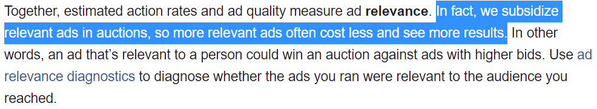
```

--

→ ***Implies big role of the ad delivery algorithm***


---

class: center, middle

## Prior investigations into the<br>role of the ad delivery algorithm

---

### Pricing differences in the US 2020 election

+ Biden campaign paid more than **6x more** 
  + compared to Trump campaign when targeting older voters. [(The Markup 2020)](https://themarkup.org/election-2020/2020/10/29/facebook-political-ad-targeting-algorithm-prices-trump-biden)
  
  
<center>
```{r, out.width="60%", echo = F}
knitr::include_graphics("img/older.png")
```
</center>
  
<!--  -->
  

---

### Prior Research (Ali et al., 2020,2021)


When targeting the same audience, at the same time, with the same budget:

+ Ad delivery is heavily skewed along gendered and racial stereotypes
  + even without the intent of the advertiser [(Ali et al. 2020)](https://dl.acm.org/doi/10.1145/3359301)

--

Regarding political ads [(Ali et al., 2021)](https://dl.acm.org/doi/pdf/10.1145/3437963.3441801):

--

+ **Skewed delivery**

  + Political ads more often delivered to ideologically congruent audience 
      + Bernie ads → higher % D; 
      + Trump ads → higher % R

--

+ **Increased cost**

  + Liberal ad to a liberal audience: *21 Dollar per 1000 users*; 
  + Conservative ad delivered to liberal audience: *40 Dollar per 1000 users*.


---


class: white


---

### Why study black box of the Facebook algorithm


+ Severely limiting or banning microtargeting is *inadequate*

It would:

1. not end “targeting”

2. give more “autonomy” to the platform and its ad delivery algorithm

3. would make it more difficult to create transparency

<br>

→ *regulations that only focus on the advertiser “capabilities” and not also the ad delivery algorithm falls short*

---

### Why study black box of the Facebook algorithm


+ Facebook may (dis-)advantage certain parties

  + Equal-time rule?

--

+ Parties may pay more money to persuade potential voters

  + It might be more costly to reach people who are undecided

--

+ Political campaigns may not reach their intended audiences 

  + only the people that *already agree with the message*
  
  + certain groups might be excluded entirely
  
  + potentially exasperates the fragmentation of the political landscape


---

class: center, middle

## Research Question

### How does the Facebook ad delivery algorithm<br>influence the pricing & distribution of political ads<br>in the Netherlands?

---

class: center, middle

# Research Design

---

### Research Design

+ Collaborate with Dutch parties to place political ads

+ We reached out to 7 major political parties

  + heard back from 3, all of which gave us a tentative ***yes***
  
--

<br>
  
+ Experimental design that varies targeting criteria (and content)

+ Estimated timeframe for placing ads: ~ Late January to mid-February 2022

  + close to Netherlands-wide local elections in March 2022

--
  
<br>
  
+ Plan is to pre-register

---


### Research Design

+ The study design will incorporate two *levels of comparisons*

      Observing differences of pricing and delivery:

  1. *within a party* (i.e. different targeting criteria and content)

  2. *between parties*
  


---

### Research Design

Facebook says it delivers ads based on a "relevancy" score

→ Facebook optimizes for ***perceived*** *congruency* between the content/message of the ad and the person seeing the ad

We hypothesize some audiences might therefore be *harder to reach*
  + as in: more expensive
  + reach less people given the same conditions (budget and timing)
  

  
--

In order to test the algorithm we need to:

+ Place ads with ad goal: *Reach*
+ Ad optimization: *Unique users reached*

--

Optimizing on Reach (rather than Traffic): 
   
+ the algorithm has to work more on its internal assumptions 
+ doesn't use user cues (i.e. clicks) as much to decide who is going to see the ad

---


### Dependent Variables

+ Price per 1k users reached

  + this measure is an industry standard

+ Delivery of ads 

  + Audience shares measured by % of ads delivered to specific group
  
      + Gender
  
      + Age
    
      + Region
  
      + Targeting criteria


---


class: center, middle

# "Election date reminder" ads and proposed conditions


---

class: white

### "Election date reminder" ads and proposed conditions

.pull-left[

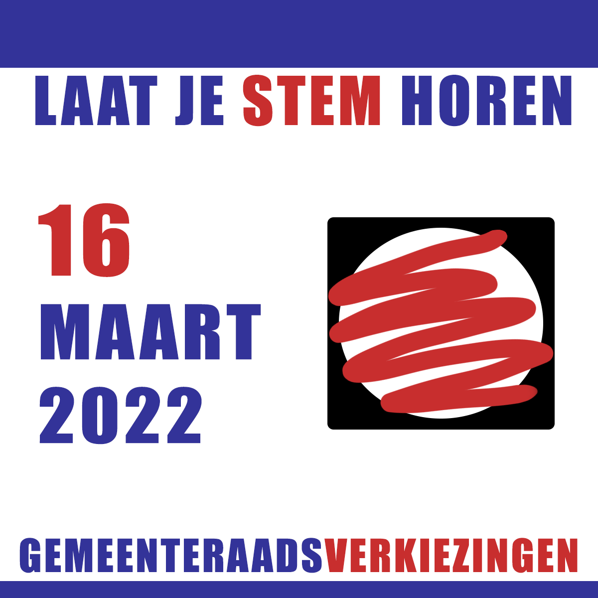

Note: this is only an example to showcase the idea. Not the final design.

]

.pull-right[


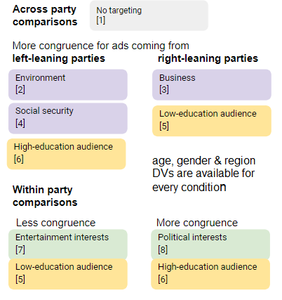


]

---

### Cross-party conditions

--

.pull-left[
Hypotheses:

Audiences that lean left 
  + interested in environment
  + social security
  + high educated
  + women
  
are harder to reach for right-leaning parties (and vice versa)


Audiences that lean right 
  + interested in business
  + lower-educated + vocational
  + men

are harder to reach for left-leaning parties (and vice versa)

]


.pull-right[


]

---

### Intra-party conditions: Entertainment vs. Political audiences

.pull-left[
The Facebook algorithm may assume that informative ads about election day are

+ *less relevant* for people interested in entertainment (sports, TV shows, video games) 
+ than for people already interested in (local) politics

<br>

Therefore, we expect that **ads targeted at people interested in entertainment**
  + are **more costly** and **reach less people** 
  + compared to people already interested in politics
  
]


.pull-right[


]

---


### High-education vs. low-education

.pull-left[


The Facebook algorithm may assume that informative ads about election day are

+ *less relevant* for lower-educated audiences (lower interested in politics) 
+ than for higher-educated audiences.

<br>

Therefore, we expect that **ads targeted at lower-educated audiences**
  + are **more costly** and **reach less people** 
  + compared to higher-educated audiences.
  
]
  
.pull-right[


]
  
---

### Younger vs. Older audiences

The Facebook algorithm may assume that informative ads about election day are

+ *less relevant* for younger people (lower turnout rate) 
+ than for older people

<br>

Therefore, we expect that ads
  + are **more costly** when reaching younger people
  + compared to older people

---


class: center, middle

## Pre-Test

### Very (!) early results

---

## Pre-Test


Place 30 ads on Facebook for 7 days

+ No targeting (18+, all genders, all of Netherlands)
+ Target high-educated audience
+ Target low-educated audience

Daily budget: 1 Euro (in total = 210 Euros)

Reached: 61,137 people

---

class: white

## Cost per 1k Users

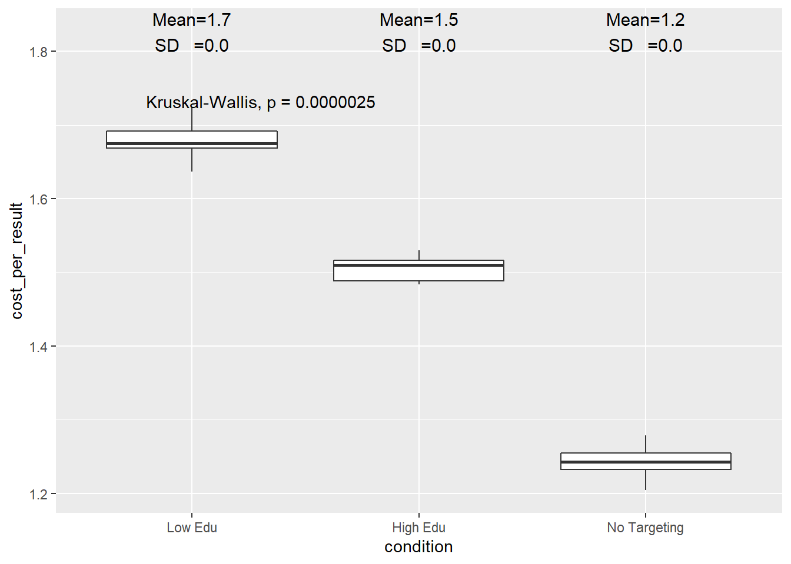


---

class: white


## Cost per 1k Users

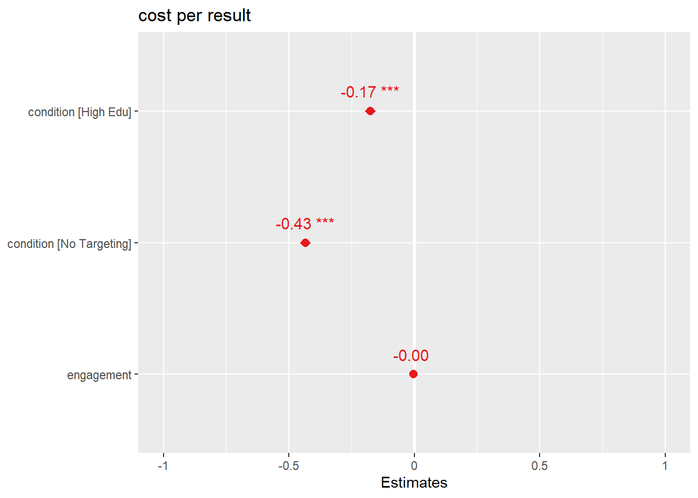


---

class: white

## Cost per age group

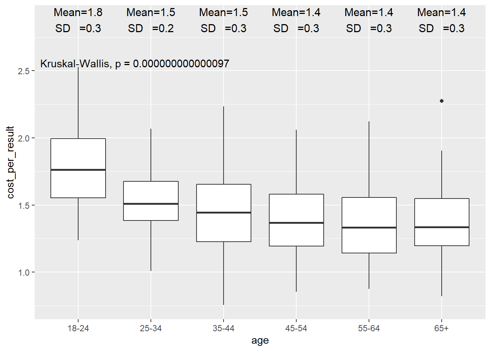


---

class: white

## Cost per age group

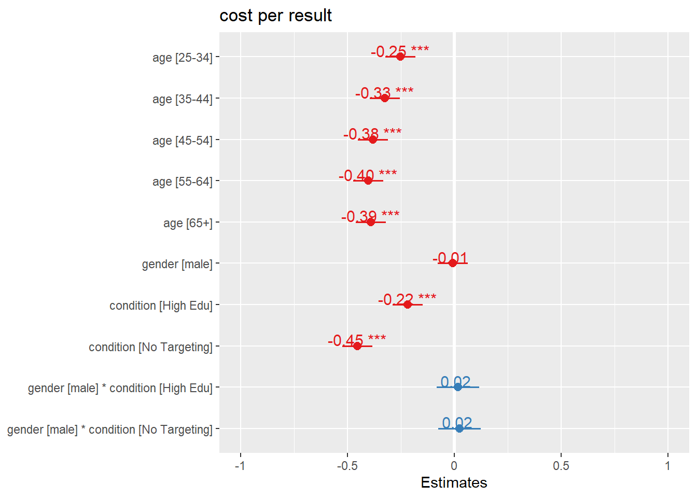

---


class: white

## Skewed delivery in terms of gender

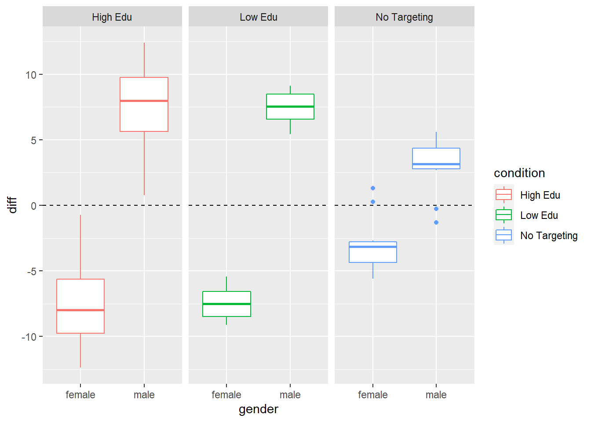

---

class: white

## Less clear for age groups

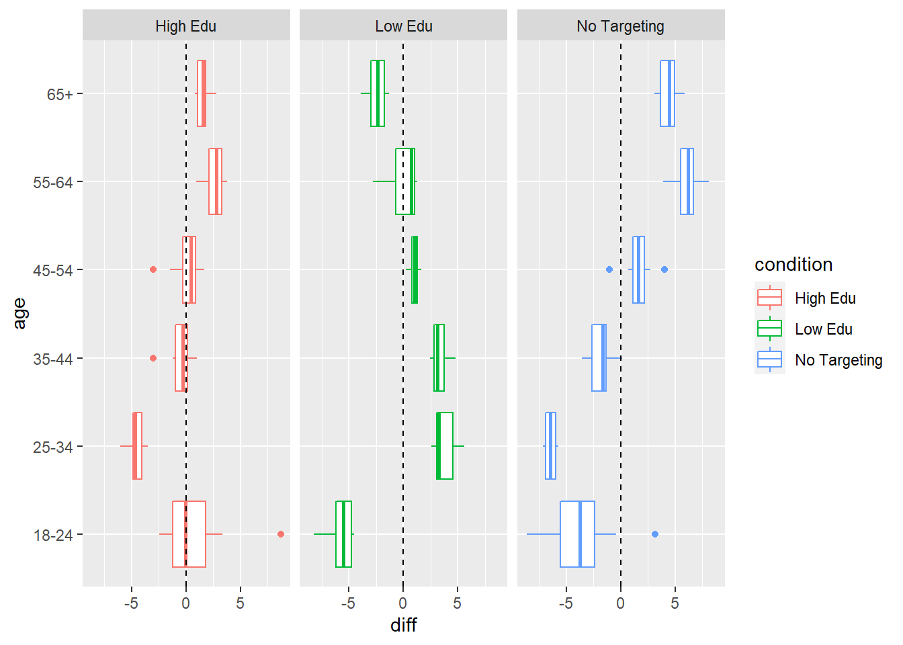

---


<br>
<br>
<br>

<center>


<!--  -->

</center>


---

class: center, middle

# Let's discuss


---

class: center, middle

# Appendix


---

# My questions

+ Is an experimental design even possible/desirable here?
  + It would require to place ~10-20 ads per condition per party to be properly powered
  + 10-20 ads per condition per party could potentially lead to overpricing the market of a targeted audience?
  → so some ads I place might influence the outcomes for other ads
  + is there a way to account for that in an experimental design?
  + should I make this an observational study instead, place less ads per condition and just bite the bullet on causality being too difficult to establish in regards to treating the ad delivery algorithm?

+ What kind of conditions 

  + made the most sense to you?
  + would be most valuable?
  + how could they be improved?
  
  
+ Does the measurement for ad delivery skew make sense?


+ I've been struggling with the power analysis and the effect sizes I should expect so I can properly determine sample size per condition. Any advice?

---


class: center, middle

# Issue ads and proposed conditions

## Observing differences of pricing and delivery *between* and *within a party*


---

### Example Topic: Climate Change

--

Does Facebook charge more money/skew delivery when ads about *climate change* are targeted at:
+ people with interest in environmentalism vs. people interested in business 
+ younger people vs. older people
+ rural vs. urban regions 
+ low vs. high education
+ more right-leaning vs. left-leaning parties?

--

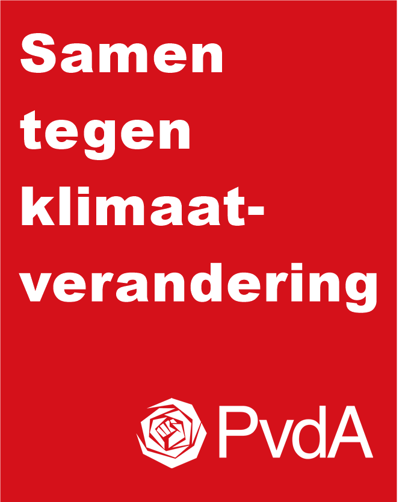
--
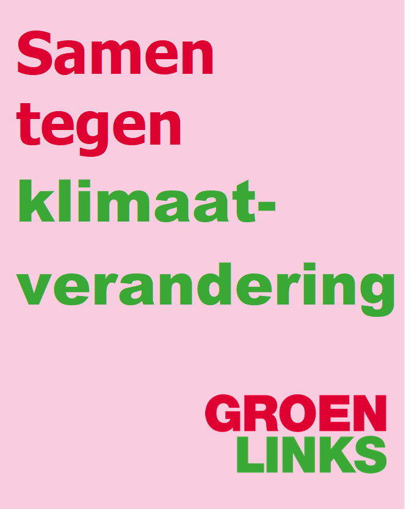
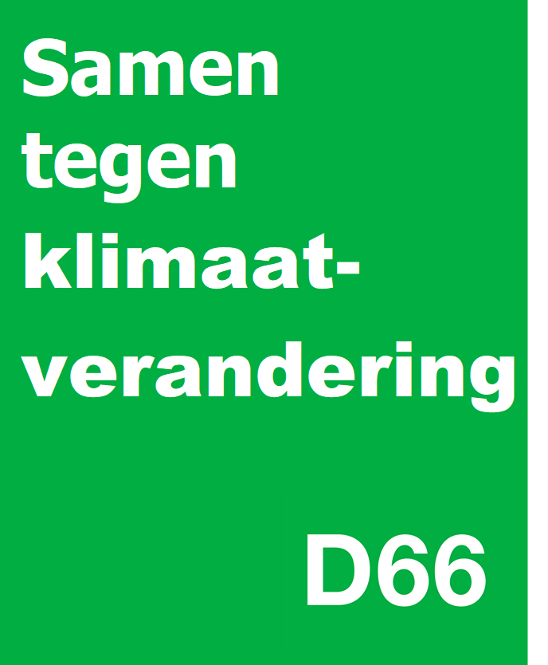
<p style="clear: both;">


---


class: center, middle


### Going Micro to Go Negative

#### Research Question: 

To what extent is political microtargeting used by<br>political advertisers to deliver uncivil
campaign messages?

---


class: center, middle

## Going micro


---

### Political Microtargeting

> Personalizing political campaign messages based on large-scale data collection

+ Cambridge Analytics

+ IRA influence campaign

+ Topic is understudied in European context

---

class: center, middle

## Negative campaigning

*"going negative"*

---

## Negative campaigning

Negative campaigning is a type of advertising that highlights alleged weaknesses of the competitor.

--

*However:* Negative ads are not just negative ads

According to Brooks & Geer (2012) negative campaigning entails:

+ *civil* negative ads

  + legitimate criticism of the opponent
  
--

+ *uncivil* negative ads 

  + "disrespectful, poisonous and hyperbolic [...]" language that "break norms of conversation [...]" (Otto et al. 2020)


<br>

> Let's take a closer look at incivility as a form of negative advertising

---

class: center, middle

## Political Incivility

*Is it good to be bad?*

---

## Political Incivility

Acoording to Mutz (2016) political incivility can:

 + lower trust in government

 + reduce faith in institutions 

 + lessen respect for opposing views

--

**But** it can also: 

+ generate stronger interest in voting & in politics more generally (Herbst 2010)

+ increase the memorability of the topics discussed; also known as *negativity bias* (Sydnor 2019)

---


class: center, middle

## Backlash effect

*When attacking your opponent backfires*

--

*or: when it's bad to be bad*

---

## Backlash effect

Negative advertising can backfire because voters feel sympathetic toward candidates under attack (Walter & van der Eijk, 2019).

Meta-analysis confirms a backlash effect in 33 out of 40 studies (Lau et al., 2009)

--

Backlash effect can be dependent on voter (and candidate) characteristics:

 + Backlash towards African-American attack sponsors is greater among white voters (Krupnikov and Piston 2015)

 + Nai & Maier (2020) also demonstrate that with incivil ads:

--

    + people high in conflict avoidance significantly reduce rating of the **attack sponsor**

    + individuals high in psychopathy traits rate the **target more negatively**


---


class: center, middle

## Microtargeting and Negative ads

*"going micro"*

---


## Microtargeting and Negative ads

Microtargeting may lower the risk of backlash effects because:

+ Negative messages can be targeted towards individuals who are most susceptible to them (Nai & Maier 2020)

  + also means: people likely to dislike negativity can be excluded

--
  
+ Negative campaigning is seen as undesirable and harmful by the public
    + (Mutz and Reeves 2005; Mattes and Redlawsk 2014)

--

+ A smaller range of individuals are affected if there were to be a backlash

*Hypotheses:*

> H1: Microtargeted ads from political campaigns are more negative than ads targeted at more general audiences.

> H2: For outside groups we should not find this microtargeting effect because they are less concerned about reputational hits.

---


## Microtargeting and Negative ads

Literature that have looked at this is scarce but two examples stood out:

+ Fowler et al. (2020) analyze TV and Facebook and find the latter to be more positive

  + Campaigns are more likely to have lists of supporters and they are less targeted with negative ads

  + However: only compares TV ads with Facebook and does not differentiate between levels of targeting
  
--

<br>
  
+ Jain and Wood (2020) analyze Facebook ad library data

  + Computer Science pre-print, does not go in a lot of detail but they do find a positive effect of microtargeting on tone

  + However: measure of microtargeting is just received impressions


---

## Measurement

+ Dependent Variable: Negativity/Incivility
  + Perspective API (Toxicity)
  + Prediction by supervised machine learning model trained on incivil/civil negative & positive ads
      
--
  
+ Independent Variable: Microtargeting

> `Potential Reach` estimates how many people your ad could potentially reach depending on the targeting and ad placement options you select while creating an ad. ~Facebook Ad Library

--

.pull-left[
+ 100 - 1.000 individuals reached
+ 1.001 - 5.000
+ 5.001 - 10.000
+ 10.001 - 50.000
+ 50.001 - 100.000
+ 100.001 - 500.000
+ 500.001 - 1 million
+ +1 million
]

.pull-right[
  <br>
  <br>
  <br>
  The smaller the reach the more microtargeted is an advertisement.
]


---

## Results


---

## Takeaways

---

