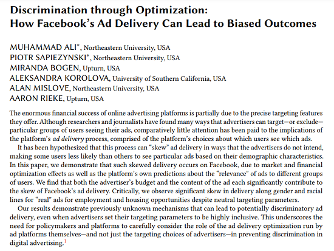
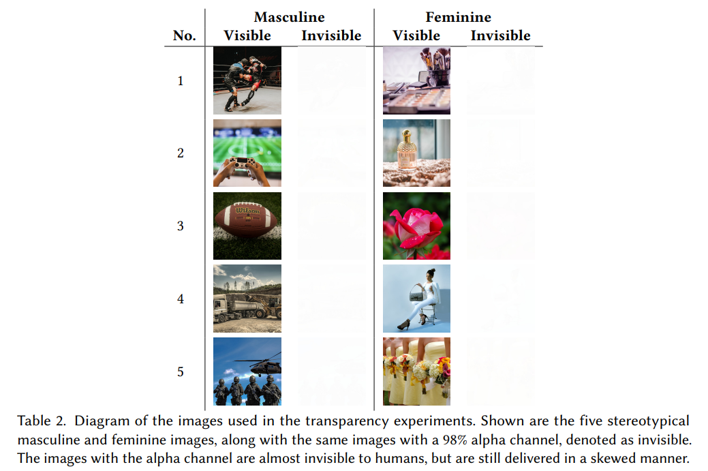
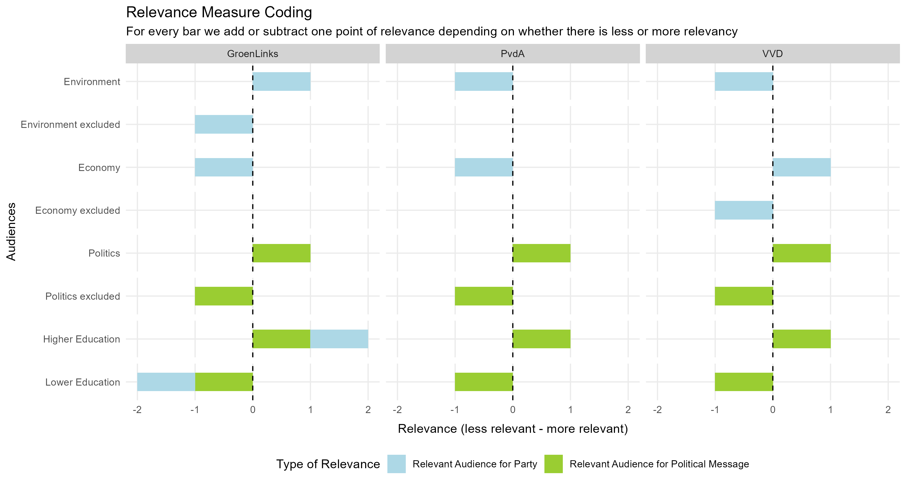

layout: true
    
<div class="logo"></div> 


```{r setup, include=FALSE}
# Here you can place global options for the entire document.
# Mostly used for knitr settings, but can also load data etc.
# Whatever happens here will not show in the presentation.
knitr::opts_chunk$set(fig.retina = 3, 
                      warning = FALSE, 
                      message = FALSE,
                      echo = F)


library(tidyverse)

source("../algo_ads/helpers.R")

# dir("../img", recursive = T, full.names = T) %>%
#   walk(~{file.copy(.x, str_remove(.x, "\\.\\.\\/"))})
```


---

### The "bad actor"-story of political microtargeting

--

+ Discourse on political microtargeting is often focused on the "bad actor" story

  + Russian election interference campaign (Internet Research Agency)
  
  + Cambridge Analytica scandal
  
  + Target specific groups with the intention to manipulate/dissuade from voting

--


+ The implicit assumption:
  
    + advertisers have strong control over who sees which ad 

--

<br>

**But who ultimately decides to whom an ad is delivered to?**

> The ad delivery algorithm

---

class: 

### Ad delivery algorithms

Meta says:

> *The Facebook ad delivery system uses an **ad auction** and **machine learning** to determine where, when and to whom we show your ads. These processes work together to maximize value for both people and businesses.*

--

+ Ad auctions

  + Each time there's an opportunity to show an ad to someone, an auction takes place to determine which ad to show to that person. 

--
  
&#8594; **More about that later**
  
--


+ Machine learning

  + Models trained on internal platform data to deliver ads to the  *"right"* audience

---


### Prior Research into Ad Delivery Algorithms

**Job ads and Housing**

* Discrimination in Online Ad Delivery [(Sweeney, 2013)](https://doi.org/10.1145/2460276.2460278) 

* Algorithmic bias? An empirical study of apparent gender-based discrimination in the display of stem career ads [(Lambrecht and Tucker, 2019)](https://doi.org/10.1287/mnsc.2018.3093) 

* Auditing Race and Gender Discrimination in Online Housing Market [(Asplund et al., 2020)](https://ojs.aaai.org/index.php/ICWSM/article/view/7276) 

* Auditing for Discrimination in Algorithms Delivering Job Ads [(Imana et al., 2021)](https://ant.isi.edu/datasets/addelivery/Discrimination-Job-Ad-Delivery.pdf) 

--

**More general and political ads**

* Discrimination through Optimization: How Facebook’s Ad Delivery Can Lead to Biased Outcomes
 [(Ali et al. 2020)](https://dl.acm.org/doi/10.1145/3359301)

* Ad Delivery Algorithms: The Hidden Arbiters of Political Messaging [(Ali et al., 2021)](https://dl.acm.org/doi/pdf/10.1145/3437963.3441801) 

---

class: white

### Prior Research (Ali et al., 2020,2021)

.pull-left[

]


.pull-right[

]


---

### Prior Research (Ali et al., 2020,2021)


When targeting the same audience, at the same time, with the same budget:

+ Ad delivery is heavily skewed along gendered and racial stereotypes
  + even without the intent of the advertiser [(Ali et al. 2020)](https://dl.acm.org/doi/10.1145/3359301)
  
--

.pull-left[
**Delivery remains skewed even with blank image**

Images invisible to humans but still detectable by algorithm:

+ yield **similar skews** in delivery

+ highlights importance of algorithm

+ less based on differences in user behavior/preferences
]

.pull-right[

]


---


### Prior Research (Ali et al., 2020,2021)


When targeting the same audience, at the same time, with the same budget:

Regarding political ads [(Ali et al., 2021)](https://dl.acm.org/doi/pdf/10.1145/3437963.3441801):

--

.pull-left[
+ **Skewed delivery**

  + Political ads more often delivered to ideologically congruent audience 
      + Bernie ads → higher % D; 
      + Trump ads → higher % R

+ **Increased cost**

  + Liberal ad to a liberal audience: *21 Dollar per 1000 users*; 
  + Conservative ad delivered to liberal audience: *40 Dollar per 1000 users*.
]

--

.pull-right[
**Results hold** 

+ when tricking Facebook into classifying non-partisan ads as partisan


]


---


### How are ad costs determined?

**Ad auctions**

--

Each time there is a possibility to show an ad, an ad auction takes place.

--

The winner of the auction is determined by *bids* and *ad relevance*:

--

+ *Bid:* 

  + what the advertiser is willing to pay 

--

+ *Ad relevance:* 

  + predicated probability that delivery leads to desired outcome (e.g. clicks, views)
  
      + when audiences find ads "engaging, interesting or eye-catching"

  + conforming to FB quality standards (e.g. no clickbait)


---

class: center, middle

## The Dutch case

---

class: white


---


class: center, middle

## Research Question

### How does the Facebook ad delivery algorithm<br>influence the pricing & distribution of political ads<br>in the Netherlands?

---

class: center, middle

# Research Design

---

### Research Design

+ Collaborate with Dutch parties to place political ads

+ We reached out to 7 major political parties

  + final collaboration with 3: GroenLinks, VVD and PvdA
  
--

<br>
  
+ Experimental design that varies targeting criteria (and parties)

+ Place ads from 1st to 8th Feburary 2022

  + close but not too close to Netherlands-wide local elections in March 16th 2022

--
  
<br>
  
+ Pre-registered research design and hypotheses

---


### Dependent Variables

+ Price per 1k users reached

  + this measure is an industry standard

+ Delivery of ads 

  + Audience shares measured by % of ads delivered to specific group
  
      + Gender
  
      + Age
    
      + Region
  
      + Targeting criteria


---


### Dependent Variables

The study design incorporates two *levels of comparisons*

Observing differences of pricing and delivery:

  1. *within a party* (i.e. different targeting criteria)

  2. *between parties*
  
---


### Independent Variable: Ad Relevance

We theorize two different but possibly overlapping levels of (predicted) relevance:

--

1. *Relevant audience for ad content (i.e. political message)*

--

  + Political message likely to be relevant for people interested in politics

--

2. *Relevant audience for party (i.e. source of ad)*

--

  + Ads from an environmentalist party more likely to be relevant for audience interested in environmentalism.

--

**Hypotheses:**

> H1: The more relevant an audience is for an ad, the cheaper is the cost for reaching 1000 users in that audience.

> H2: The more relevant an audience is for an ad, the more are ads delivered to that audience.


---


### Targeting criteria

We used 9 different targeting criteria for our advertisements

.pull-left[

1. Political interests
2. Excluding political interest


]

.pull-right[

**Relevant audience for ad content**

> Targeting political ads to audiences who are interested in politics 

> + H1a) *is less expensive* 

> + H2a) *deliver more* 

> than targeting audiences who are not interested in politics. 


]


---

### Targeting criteria


We used 9 different targeting criteria for our advertisements

.pull-left[

1. Political interests
2. Excluding political interest
  

<ol start="3">
  <li>Higher educated audience</li>
  <li>Lower educated audience</li>
</ol>


]

.pull-right[

**Relevant audience for ad content**

> Targeting political ads to higher-educated audiences

> + H1b) *is less expensive* 

> + H2b) *deliver more* 

> than targeting lower-educated audiences. 


]


---

### Targeting criteria


We used 9 different targeting criteria for our advertisements

.pull-left[

1. Political interests
2. Excluding political interest

<ol start="3">
  <li>Higher educated audience</li>
  <li>Lower educated audience</li>
</ol>


]

.pull-right[


**Relevant audience for party**


> Targeting political ads to higher-educated audiences

> + H1c) *is less expensive* 

> + H2c) *deliver more* 

for GroenLinks compared to the PvdA and VVD. 

]


---

### Targeting criteria


We used 9 different targeting criteria for our advertisements

.pull-left[

1. Political interests
2. Excluding political interest
  
  
<ol start="3">
  <li>Higher educated audience</li>
  <li>Lower educated audience</li>
</ol>

<ol start="5">
  <li>Environmental interests</li>
  <li>Excluding environmental interests</li>
</ol>

  

]

.pull-right[


**Relevant audience for party**


> Targeting political ads to audiences interested in environenmentalism

> + H1d) *is less expensive* 

> + H2d) *deliver more* 

for GroenLinks compared to the PvdA and VVD. 

]


---


### Targeting criteria


We used 9 different targeting criteria for our advertisements

.pull-left[

1. Political interests
2. Excluding political interest
  
<ol start="3">
  <li>Higher educated audience</li>
  <li>Lower educated audience</li>
</ol>

<ol start="5">
  <li>Environmental interests</li>
  <li>Excluding environmental interests</li>
</ol>

<ol start="7">
  <li>Economic interests</li>
  <li>Excluding Economic interests</li>
</ol>

]

.pull-right[


**Relevant audience for party**


> Targeting political ads to audiences interested in the economy

> + H1e) *is less expensive* 

> + H2e) *deliver more* 

for VVD compared to the PvdA and GroenLinks. 

]


---


### Targeting criteria


We used 9 different targeting criteria for our advertisements

.pull-left[

1. Political interests
2. Excluding political interest

<ol start="3">
  <li>Higher educated audience</li>
  <li>Lower educated audience</li>
</ol>

<ol start="5">
  <li>Environmental interests</li>
  <li>Excluding environmental interests</li>
</ol>

<ol start="7">
  <li>Economic interests</li>
  <li>Excluding Economic interests</li>
</ol>
  
<ol start="9">
  <li>No Targeting</li>
</ol>

]

.pull-right[

We expect that the Meta ad delivery algorithm has an easier time finding a relevant audience for parties that have more support in the public.


> H3a: Parties with a greater share of supporters pay less for reaching 1000 users.

> H3b: Parties with a greater share of supporters reach more people than smaller parties.

]

---

class: white

### Design Overview

+ We determined the minimum number of ads we need per condition and that is *5* 

   + 9 conditions * 5 ads = 45 ads per party (135 in total)

<center>

</center>


---


### Research Design

Facebook says it delivers ads based on a "relevance" score

→ Facebook optimizes for ***perceived*** *match* between the content/message of the ad and the person seeing the ad

We hypothesize some audiences might therefore be *harder to reach*
  + as in: more expensive
  + reach less people given the same conditions (budget and timing)
  

  
--

In order to test the algorithm we need to:

+ Place ads with ad goal: *Reach*
+ Ad optimization: *Unique users reached*

--

Optimizing on Reach (rather than Traffic): 
   
+ the algorithm has to work more on its internal assumptions 
+ doesn't use user cues (i.e. clicks) as much to decide who is going to see the ad

---

class: center, middle

# Ad Creative and Setup


---

## Ad Creative and Setup

+ Infos about the election and how to vote from the *Rijksoverheid*

+ Official Get-Out-To-Vote campaign "Elke Stem Telt" for local elections

+ Selected *Five* Images from campaign that we would like to run

<br>


+ https://www.kiesraad.nl/verkiezingen/gemeenteraden

---

## Ad Images (1 and 2 out of 5)

.pull-left[


]


.pull-right[


]


---


## Ad Images (3 and 4 out of 5)

.pull-left[


]


.pull-right[


]


---

## Ad Images (5 out of 5)


.pull-left[


]


---

## How the ad looked like on Desktop


<p style="clear: both;">


---

## How the ad looked like on Desktop


---

## How the ad looked like on Desktop


---


class: center, middle

## Results

--

Estimate linear regressions with IVs: targeting criteria and party

DV: cost per 1000 users, reach (unique people)

All models presented here are controlled for engagement

---

class: white

### Descriptives

.pull-left[

```{r}
overview <- readRDS("data/overview.rds")

set.seed(24101991)

overview %>% 
  drop_na(targeting) %>% 
  mutate(party = fct_relevel(party, c("PvdA", "GroenLinks", "VVD"))) %>% 
  mutate(targeting = fct_reorder(targeting, cost_per_1_000_people_reached)) %>% 
  ggplot(aes(targeting, cost_per_1_000_people_reached)) +
  geom_jitter() +
  geom_boxplot(width = 0.3) +
  coord_flip() +
  theme_minimal() +
  ggtitle("Cost per 1k users") +
  theme(plot.title = element_text(size = 19, face = "bold")) 

```

]


.pull-right[

```{r}
overview %>% 
  drop_na(targeting) %>% 
  mutate(party = fct_relevel(party, c("PvdA", "GroenLinks", "VVD"))) %>% 
  mutate(targeting = fct_reorder(targeting, reach)) %>% 
  ggplot(aes(targeting, reach)) +
  geom_jitter() +
  geom_boxplot(width = 0.3) +
  coord_flip() +
  theme_minimal() +
  ggtitle("Reach") +
  theme(plot.title = element_text(size = 19, face = "bold")) 
```

]


---


class: white

### Descriptives


.pull-left[

```{r}

overview %>% 
  drop_na(targeting) %>% 
  mutate(party = fct_relevel(party, c("PvdA", "GroenLinks", "VVD"))) %>% 
  mutate(targeting = fct_reorder(targeting, cost_per_1_000_people_reached)) %>% 
  ggplot(aes(targeting, cost_per_1_000_people_reached)) +
  geom_jitter(aes(color = party)) +
  geom_boxplot(width = 0.3) +
  coord_flip() +
  theme_minimal()  +
  scale_color_parties() +
  theme(legend.position = "bottom") +
  ggtitle("Cost per 1k users") +
  theme(plot.title = element_text(size = 19, face = "bold")) 

```

]


.pull-right[

```{r}
overview %>% 
  drop_na(targeting) %>% 
  mutate(party = fct_relevel(party, c("PvdA", "GroenLinks", "VVD"))) %>% 
  mutate(targeting = fct_reorder(targeting, reach)) %>% 
  ggplot(aes(targeting, reach)) +
  geom_jitter(aes(color = party)) +
  geom_boxplot(width = 0.3) +
  coord_flip() +
  theme_minimal() +
  scale_color_parties() +
  theme(legend.position = "bottom") +
  ggtitle("Reach") +
  theme(plot.title = element_text(size = 19, face = "bold")) 
```

]


---

class: white

### Descriptives

.pull-left[

```{r}

overview %>% 
  drop_na(targeting) %>% 
  mutate(party = fct_relevel(party, c("PvdA", "GroenLinks", "VVD"))) %>% 
  mutate(targeting = fct_reorder(targeting, cost_per_1_000_people_reached)) %>% 
  ggplot(aes(targeting, cost_per_1_000_people_reached, color = party)) +
  geom_boxplot() +
  coord_flip() +
  theme_minimal() +
  scale_color_parties() +
  theme(legend.position = "bottom")+
  ggtitle("Cost per 1k users") +
  theme(plot.title = element_text(size = 19, face = "bold")) 

```

]

.pull-right[

```{r}

overview %>% 
  drop_na(targeting) %>% 
  mutate(party = fct_relevel(party, c("PvdA", "GroenLinks", "VVD"))) %>% 
  mutate(targeting = fct_reorder(targeting, cost_per_1_000_people_reached)) %>% 
  ggplot(aes(targeting, cost_per_1_000_people_reached, color = party)) +
  geom_boxplot() +
  coord_flip() +
  theme_minimal() +
  scale_color_parties() +
  theme(legend.position = "bottom") +
  ggtitle("Reach") +
  theme(plot.title = element_text(size = 19, face = "bold")) 

```
]


---

class: center, middle

## Hypothesis H3

H3a: Parties with a greater share of supporters pay less for reaching 1000 users. 

H3b: Parties with a greater share of supporters reach more people than smaller parties.


---


class: white

### Hypothesis H3: descriptives

--

.pull-left[

```{r, echo=F}

share_dat <- overview %>% 
  drop_na(ad_name) %>%
  # set_names(names(overview_uva)) %>% 
  mutate(pair = readr::parse_number(ad_set_name)) %>% 
  mutate(comparison = case_when(
    str_detect(ad_name, "Economy") ~ "Economy",
    str_detect(ad_name, "Environment") ~ "Environment",
    str_detect(ad_name, "Education") ~ "Education",
    str_detect(ad_name, "Politics") ~ "Politics",
    T ~ NA_character_
  )) %>% 
  drop_na(comparison) %>% 
  # count(ad_name)
  group_by(pair, comparison, party) %>% 
  mutate(total = sum(reach),
         share = reach/total*100) %>% 
  ungroup()

overview %>% #filter(is.na(targeting))
  drop_na(targeting) %>% 
  # filter(targeting == "No Targeting") %>%
  mutate(party = fct_relevel(party, c("PvdA", "GroenLinks", "VVD"))) %>% 
  ggplot(aes(party, cost_per_1_000_people_reached)) + # Move y and x here so than they can be used in stat_*
  geom_jitter(width = 0.2) +
  geom_boxplot(aes(color = party), width = 0.2) +
  # stat_summary(aes(color = party), fun = mean, fun.min = mean, fun.max = mean,
  #              geom = "crossbar", width = 0.5) +
  scale_color_parties() +
  theme_minimal() +
  theme(legend.position = "none", plot.title = element_text(size = 19, face = "bold")) +
  # ggpubr::stat_compare_means() +
  EnvStats::stat_mean_sd_text(digits = 2) +
  labs(y = "Cost per 1000 users reached\nin Euros (across all conditions)", x = "Party", title = "Cost per 1000 users\n") 
```

]

--

.pull-right[

```{r, echo=F}

overview %>% 
  drop_na(targeting) %>% 
  # filter(targeting == "No Targeting") %>%
  mutate(party = fct_relevel(party, c("PvdA", "GroenLinks", "VVD"))) %>% 
  ggplot(aes(party, reach)) + # Move y and x here so than they can be used in stat_*
  geom_jitter(width = 0.2) +
  geom_boxplot(aes(color = party), width = 0.2) +
  # stat_summary(aes(color = party), fun = mean, fun.min = mean, fun.max = mean,
  #              geom = "crossbar", width = 0.5) +
  scale_color_parties() +
  theme_minimal() +
  theme(legend.position = "none", plot.title = element_text(size = 19, face = "bold")) +
  # ggpubr::stat_compare_means() +
  EnvStats::stat_mean_sd_text(digits = 0) +
  labs(y = "Reach (across all conditions)", x = "Party", title = "Reach (unique people)\n") 
```


]


---


class: white

### Hypothesis H3

.pull-left[

H3a: Parties with a greater share of supporters pay less for reaching 1000 users. 


```{r}
mod_nobreak_h3a <- lm(cost_per_result ~ party + engagement, data = overview %>% filter(targeting == "No Targeting"))
# lm.beta::lm.beta(mod)

    
sjPlot::plot_model(mod_nobreak_h3a, show.values = T, show.p = T) +
  theme_minimal() +
  geom_hline(yintercept = 0, linetype = "dashed") +
  ylim(-0.13, 0.05) +
  ggtitle("Cost per 1000 users") +
  theme(plot.title = element_text(size = 19, face = "bold")) 
```

]

--

.pull-right[

H3b: Parties with a greater share of supporters reach more people than smaller parties.


```{r}
mod_nobreak_h3b <- lm(reach ~ party + engagement, overview %>% filter(targeting == "No Targeting"))
# lm.beta::lm.beta(mod)

    
sjPlot::plot_model(mod_nobreak_h3b, show.values = T, show.p = T) +
  theme_minimal() +
  geom_hline(yintercept = 0, linetype = "dashed") +
  # ylim(-0.13, 0.05) +
  ggtitle("Reach") +
  theme(plot.title = element_text(size = 19, face = "bold")) 
```
]


---


class: middle, center

### Audiences interested in politics

H1a: Audiences interested in politics are cheaper

H2a: Ads are delivered more to people interested in politics

---

class: white

#### H1a: Audience interested in politics is cheaper

.pull-left[
```{r}
overview %>% 
  mutate(party = fct_relevel(party, c("PvdA", "GroenLinks", "VVD"))) %>% 
  filter(str_detect(targeting, "Politics")) %>% 
  ggplot(aes(party, cost_per_1_000_people_reached, color = targeting)) +
  geom_boxplot() +
  # coord_flip() +
  theme_minimal() +
  ggthemes::scale_color_colorblind() +
  theme(legend.position = "top")
  
  # overview %>% 
  # filter(str_detect(targeting, "Politics")) %>% 
  # group_by(party, targeting) %>% 
  #   summarize(mean_cost = mean(cost_per_1_000_people_reached))
```
]

--

.pull-right[
```{r}
mod_nobreak_h1ab <- lm(cost_per_result ~ targeting * party + engagement, data = overview %>%
                         filter(str_detect(targeting, "Politics")))


# sjPlot::plot_model(mod_nobreak_h1ab, show.p = T, show.values = T, type = "int")
```

```{r}
library(parameters)
library(modelbased)

contrasts_nobreak_h1ab <- estimate_contrasts(mod_nobreak_h1ab, contrast = c("targeting", "party"),
                                at = c("targeting",  "party")) %>% 
  as.data.frame()  %>%  
  mutate(Contrast = paste(Level1, "-", Level2)) %>%  
  mutate(condition_comparison = fct_reorder(Contrast, Difference)) 

contrasts_nobreak_h1ab %>% 
  as_tibble()  %>% 
  filter(
    str_count(condition_comparison, "PvdA") == 2 |
    str_count(condition_comparison, "GroenLinks") == 2 |
    str_count(condition_comparison, "VVD") == 2
  ) %>% 
  # filter(str_detect(Level1, "Environment excluded") & !str_detect(Level2, "Environment excluded")) %>% 
  filter(
    # str_count(condition_comparison, "Environment") == 2 |
    # str_count(condition_comparison, "Economy") == 2 
    str_count(condition_comparison, "Politics") == 2 |
    str_count(condition_comparison, "Education") == 2 
  ) %>% 

  # in case the comparison is in wrong direction, change around
  mutate_at(vars(Difference, CI_low, CI_high), ~ifelse(str_detect(Level1, "excluded"), .x*-1, .x)) %>%
  mutate_at(vars(Difference, CI_low, CI_high), ~ifelse(str_detect(Level1, "Low"), .x*-1, .x)) %>%
  mutate(plabel = get_plabs(p)) %>% 
  mutate(diff_label = paste0(round(Difference, 3), plabel)) %>%
  mutate(party = str_extract(condition_comparison, "VVD|GroenLinks|PvdA")) %>% 
  mutate(condition_comparison = str_remove_all(condition_comparison, "VVD|GroenLinks|PvdA")) %>% 
  mutate(condition_comparison = "Price of reaching audience interested in politics (vs. not interested in politics)") %>% 
  # mutate(condition_comparison = ifelse(
  #   condition_comparison == "Entertainment - Politics",
  #   "Price of politics audience vs.\nentertainment audience",
  #   "Price of high-education audience vs.\nlow-education audience"
  #   )) %>% 
  ggplot(aes("", Difference, color = party)) + 
  geom_point(position = position_dodge(width = 0.9)) +
  geom_errorbar(aes(ymin = CI_low, ymax = CI_high), width = 0, position = position_dodge(width = 0.9)) +
  geom_text(aes(label = diff_label, y = Difference , x = c(0.8, 1.05, 1.4)), position = position_dodge(width = 0.9), show.legend = F) +
  coord_flip() +
  # geom_text(aes(label = diff_label), nudge_x = 0.1) +
  geom_hline(yintercept = 0, linetype = "dashed") +
  labs(y = "Estimated price differences of reaching 1k users in Euro",
       x = "Targeting Comparisons") +
  theme_minimal() +
  scale_color_parties() +
  # facet_grid(condition_comparison ~ ., scales= "free_y" ) +
  facet_wrap(~condition_comparison, ncol = 1, scales= "free_y" ) +
  theme(legend.position = "bottom",
        strip.text.y = element_blank(), 
        strip.background = element_rect(fill = "lightgrey")) 


```

]


---

class: white

#### H2a: Ads deliver more to people interested in politics

.pull-left[
```{r}
share_dat %>% 
  mutate(party = fct_relevel(party, c("PvdA", "GroenLinks", "VVD"))) %>% 
  filter(str_detect(targeting, "Politics")) %>% 
  ggplot(aes(party, reach, color = targeting)) +
  geom_boxplot() +
  # coord_flip() +
  theme_minimal() +
  ggthemes::scale_color_colorblind() +
  theme(legend.position = "top")
  
  # overview %>% 
  # filter(str_detect(targeting, "Politics")) %>% 
  # group_by(party, targeting) %>% 
  #   summarize(mean_cost = mean(cost_per_1_000_people_reached))
```
]

--

.pull-right[
```{r}
mod_nobreak_h2ab <- lm(reach ~ targeting * party + engagement, data = overview %>%
                         filter(str_detect(targeting, "Politics")))


# sjPlot::plot_model(mod_nobreak_h1ab, show.p = T, show.values = T, type = "int")
```

```{r}
library(parameters)
library(modelbased)

contrasts_nobreak_h2ab <- estimate_contrasts(mod_nobreak_h2ab, contrast = c("targeting", "party"),
                                at = c("targeting",  "party")) %>% 
  as.data.frame()  %>%  
  mutate(Contrast = paste(Level1, "-", Level2)) %>%  
  mutate(condition_comparison = fct_reorder(Contrast, Difference)) 

contrasts_nobreak_h2ab %>% 
  as_tibble()  %>% 
  filter(
    str_count(condition_comparison, "PvdA") == 2 |
    str_count(condition_comparison, "GroenLinks") == 2 |
    str_count(condition_comparison, "VVD") == 2
  ) %>% 
  # filter(str_detect(Level1, "Environment excluded") & !str_detect(Level2, "Environment excluded")) %>% 
  filter(
    # str_count(condition_comparison, "Environment") == 2 |
    # str_count(condition_comparison, "Economy") == 2 
    str_count(condition_comparison, "Politics") == 2 |
    str_count(condition_comparison, "Education") == 2 
  ) %>% 

  # in case the comparison is in wrong direction, change around
  mutate_at(vars(Difference, CI_low, CI_high), ~ifelse(str_detect(Level1, "excluded"), .x*-1, .x)) %>%
  mutate_at(vars(Difference, CI_low, CI_high), ~ifelse(str_detect(Level1, "Low"), .x*-1, .x)) %>%
  mutate(plabel = get_plabs(p)) %>% 
  mutate(diff_label = paste0(round(Difference, 3), plabel)) %>%
  mutate(party = str_extract(condition_comparison, "VVD|GroenLinks|PvdA")) %>% 
  mutate(condition_comparison = str_remove_all(condition_comparison, "VVD|GroenLinks|PvdA")) %>% 
  mutate(condition_comparison = "Reach of audience interested in politics (vs. not interested in politics)") %>% 
  # mutate(condition_comparison = ifelse(
  #   condition_comparison == "Entertainment - Politics",
  #   "Price of politics audience vs.\nentertainment audience",
  #   "Price of high-education audience vs.\nlow-education audience"
  #   )) %>% 
  ggplot(aes("", Difference, color = party)) + 
  geom_point(position = position_dodge(width = 0.9)) +
  geom_errorbar(aes(ymin = CI_low, ymax = CI_high), width = 0, position = position_dodge(width = 0.9)) +
  geom_text(aes(label = diff_label, y = Difference , x = c(0.8, 1.05, 1.4)), position = position_dodge(width = 0.9), show.legend = F) +
  coord_flip() +
  # geom_text(aes(label = diff_label), nudge_x = 0.1) +
  geom_hline(yintercept = 0, linetype = "dashed") +
  labs(y = "Estimated reach differences",
       x = "Targeting Comparisons") +
  theme_minimal() +
  scale_color_parties() +
  # facet_grid(condition_comparison ~ ., scales= "free_y" ) +
  facet_wrap(~condition_comparison, ncol = 1, scales= "free_y" ) +
  theme(legend.position = "bottom",
        strip.text.y = element_blank(), 
        strip.background = element_rect(fill = "lightgrey")) 


```

]

---


class: middle, center

### Audiences interested in politics

H1a: Audiences interested in politics are cheaper: `not confirmed`

H2a: Ads are delivered more to people interested in politics: `not confirmed`

---

class: middle, center

### Higher vs. lower educated audience

H1b: Higher-educated audiences are cheaper

H2b: Ads are delivered more to higher-educated people


H2c: Ads are deliver more to higher-educated people for GroenLinks

H1c: Higher-educated audiences are cheaper for GroenLinks


---

class: white

#### Higher vs. lower educated audience: cost

.pull-left[
```{r}
overview %>% 
  filter(str_detect(targeting, "Education")) %>% 
  mutate(party = fct_relevel(party, c("PvdA", "GroenLinks", "VVD"))) %>% 
  ggplot(aes(party, cost_per_1_000_people_reached, color = targeting)) +
  geom_boxplot() +
  # coord_flip() +
  theme_minimal() +
  ggthemes::scale_color_colorblind() +
  theme(legend.position = "top")
  
  # overview %>% 
  # filter(str_detect(targeting, "Politics")) %>% 
  # group_by(party, targeting) %>% 
  #   summarize(mean_cost = mean(cost_per_1_000_people_reached))
```
]

--

.pull-right[
```{r}
mod_nobreak_h1ab <- lm(cost_per_result ~ targeting * party + engagement, data = overview %>%
                         filter(str_detect(targeting, "Education")))


# sjPlot::plot_model(mod_nobreak_h1ab, show.p = T, show.values = T, type = "int")
```

```{r}
library(parameters)
library(modelbased)

contrasts_nobreak_h1ab <- estimate_contrasts(mod_nobreak_h1ab, contrast = c("targeting", "party"),
                                at = c("targeting",  "party")) %>% 
  as.data.frame()  %>%  
  mutate(Contrast = paste(Level1, "-", Level2)) %>%  
  mutate(condition_comparison = fct_reorder(Contrast, Difference)) 

contrasts_nobreak_h1ab %>% 
  as_tibble()  %>% 
  filter(
    str_count(condition_comparison, "PvdA") == 2 |
    str_count(condition_comparison, "GroenLinks") == 2 |
    str_count(condition_comparison, "VVD") == 2
  ) %>% 
  # filter(str_detect(Level1, "Environment excluded") & !str_detect(Level2, "Environment excluded")) %>% 
  filter(
    # str_count(condition_comparison, "Environment") == 2 |
    # str_count(condition_comparison, "Economy") == 2 
    str_count(condition_comparison, "Politics") == 2 |
    str_count(condition_comparison, "Education") == 2 
  ) %>% 

  # in case the comparison is in wrong direction, change around
  mutate_at(vars(Difference, CI_low, CI_high), ~ifelse(str_detect(Level1, "excluded"), .x*-1, .x)) %>%
  mutate_at(vars(Difference, CI_low, CI_high), ~ifelse(str_detect(Level1, "Low"), .x*-1, .x)) %>%
  mutate(plabel = get_plabs(p)) %>% 
  mutate(diff_label = paste0(round(Difference, 3), plabel)) %>%
  mutate(party = str_extract(condition_comparison, "VVD|GroenLinks|PvdA")) %>% 
  mutate(condition_comparison = str_remove_all(condition_comparison, "VVD|GroenLinks|PvdA")) %>% 
  mutate(condition_comparison = "Price of reaching higher-educated audience (vs. lower educated)") %>% 
  # mutate(condition_comparison = ifelse(
  #   condition_comparison == "Entertainment - Politics",
  #   "Price of politics audience vs.\nentertainment audience",
  #   "Price of high-education audience vs.\nlow-education audience"
  #   )) %>% 
  ggplot(aes("", Difference, color = party)) + 
  geom_point(position = position_dodge(width = 0.9)) +
  geom_errorbar(aes(ymin = CI_low, ymax = CI_high), width = 0, position = position_dodge(width = 0.9)) +
  geom_text(aes(label = diff_label, y = Difference , x = c(0.8, 1.05, 1.4)), position = position_dodge(width = 0.9), show.legend = F) +
  coord_flip() +
  # geom_text(aes(label = diff_label), nudge_x = 0.1) +
  geom_hline(yintercept = 0, linetype = "dashed") +
  labs(y = "Estimated price differences of reaching 1k users in Euro",
       x = "Targeting Comparisons") +
  theme_minimal() +
  scale_color_parties() +
  # facet_grid(condition_comparison ~ ., scales= "free_y" ) +
  facet_wrap(~condition_comparison, ncol = 1, scales= "free_y" ) +
  theme(legend.position = "bottom",
        strip.text.y = element_blank(), 
        strip.background = element_rect(fill = "lightgrey")) 


```

]

---

class: white

#### Higher vs. lower educated audience: reach

.pull-left[
```{r}
share_dat %>% 
  mutate(party = fct_relevel(party, c("PvdA", "GroenLinks", "VVD"))) %>% 
  filter(str_detect(targeting, "Education")) %>% 
  ggplot(aes(party, reach, color = targeting)) +
  geom_boxplot() +
  # coord_flip() +
  theme_minimal() +
  ggthemes::scale_color_colorblind() +
  theme(legend.position = "top")
  
  # overview %>% 
  # filter(str_detect(targeting, "Politics")) %>% 
  # group_by(party, targeting) %>% 
  #   summarize(mean_cost = mean(cost_per_1_000_people_reached))
```
]

--

.pull-right[
```{r}
mod_nobreak_h2ab <- lm(reach ~ targeting * party + engagement, data = overview %>%
                         filter(str_detect(targeting, "Education")))


# sjPlot::plot_model(mod_nobreak_h1ab, show.p = T, show.values = T, type = "int")
```

```{r}
library(parameters)
library(modelbased)

contrasts_nobreak_h2ab <- estimate_contrasts(mod_nobreak_h2ab, contrast = c("targeting", "party"),
                                at = c("targeting",  "party")) %>% 
  as.data.frame()  %>%  
  mutate(Contrast = paste(Level1, "-", Level2)) %>%  
  mutate(condition_comparison = fct_reorder(Contrast, Difference)) 

contrasts_nobreak_h2ab %>% 
  as_tibble()  %>% 
  filter(
    str_count(condition_comparison, "PvdA") == 2 |
    str_count(condition_comparison, "GroenLinks") == 2 |
    str_count(condition_comparison, "VVD") == 2
  ) %>% 
  # filter(str_detect(Level1, "Environment excluded") & !str_detect(Level2, "Environment excluded")) %>% 
  filter(
    # str_count(condition_comparison, "Environment") == 2 |
    # str_count(condition_comparison, "Economy") == 2 
    str_count(condition_comparison, "Politics") == 2 |
    str_count(condition_comparison, "Education") == 2 
  ) %>% 

  # in case the comparison is in wrong direction, change around
  mutate_at(vars(Difference, CI_low, CI_high), ~ifelse(str_detect(Level1, "excluded"), .x*-1, .x)) %>%
  mutate_at(vars(Difference, CI_low, CI_high), ~ifelse(str_detect(Level1, "Low"), .x*-1, .x)) %>%
  mutate(plabel = get_plabs(p)) %>% 
  mutate(diff_label = paste0(round(Difference, 3), plabel)) %>%
  mutate(party = str_extract(condition_comparison, "VVD|GroenLinks|PvdA")) %>% 
  mutate(condition_comparison = str_remove_all(condition_comparison, "VVD|GroenLinks|PvdA")) %>% 
  mutate(condition_comparison = "Reach of higher-educated audience interested (vs. lower-educated)") %>% 
  # mutate(condition_comparison = ifelse(
  #   condition_comparison == "Entertainment - Politics",
  #   "Price of politics audience vs.\nentertainment audience",
  #   "Price of high-education audience vs.\nlow-education audience"
  #   )) %>% 
  ggplot(aes("", Difference, color = party)) + 
  geom_point(position = position_dodge(width = 0.9)) +
  geom_errorbar(aes(ymin = CI_low, ymax = CI_high), width = 0, position = position_dodge(width = 0.9)) +
  geom_text(aes(label = diff_label, y = Difference , x = c(0.8, 1.05, 1.4)), position = position_dodge(width = 0.9), show.legend = F) +
  coord_flip() +
  # geom_text(aes(label = diff_label), nudge_x = 0.1) +
  geom_hline(yintercept = 0, linetype = "dashed") +
  labs(y = "Estimated reach differences",
       x = "Targeting Comparisons") +
  theme_minimal() +
  scale_color_parties() +
  # facet_grid(condition_comparison ~ ., scales= "free_y" ) +
  facet_wrap(~condition_comparison, ncol = 1, scales= "free_y" ) +
  theme(legend.position = "bottom",
        strip.text.y = element_blank(), 
        strip.background = element_rect(fill = "lightgrey")) 


```

]

---

class: middle, center

### Higher vs. lower educated audience

H1b: Higher-educated audiences are cheaper: `confirmed`

H2b: Ads are delivered more to higher-educated people: `confirmed`


H1c: Higher-educated audiences are cheaper for GroenLinks: `not confirmed`

H2c: Ads are deliver more to higher-educated people for GroenLinks: `not confirmed`

---


class: middle, center

### Audience interested in the environment

H1d: Cheaper to reach for GroenLinks

H2d: Ads by GroenLinks reach more people


---

class: white

### Audience interested in the environment: cost

.pull-left[

```{r}
overview %>% filter(str_detect(targeting, "Environment"))  %>% 
  mutate(party = fct_relevel(party, c("PvdA", "GroenLinks", "VVD"))) %>% 
  ggplot(aes(party, cost_per_1_000_people_reached, color = targeting)) +
  geom_boxplot() +
  # coord_flip() +
  theme_minimal() +
  ggthemes::scale_color_colorblind() +
  theme(legend.position = "top")
```


]

--

.pull-right[
```{r, results='asis'}
mod_nobreak_h1cg <- lm(cost_per_result ~ targeting * party + engagement, data = overview %>% filter(str_detect(targeting, "Environment")))
# lm.beta::lm.beta(mod)


# texreg::screenreg(mod_nobreak_h1cg)
```


```{r}
contrasts_nobreak_h1cg <- estimate_contrasts(mod_nobreak_h1cg, contrast = c("targeting", "party"),
                                at = c("targeting", "party")) %>% 
  as.data.frame()  %>%  
  mutate(Contrast = paste(Level1, "-", Level2)) %>%  
  mutate(condition_comparison = fct_reorder(Contrast, Difference)) 


contrasts_nobreak_h1cg %>% 
  as_tibble()  %>% 
  filter(str_count(condition_comparison, "excluded") != 2) %>% 
  filter(str_count(condition_comparison, "GroenLinks") == 2) %>% 
  bind_rows(contrasts_nobreak_h1cg %>% 
  as_tibble()  %>% 
  filter(str_count(condition_comparison, "excluded") != 2) %>% 
  filter(str_count(condition_comparison, "VVD") == 2))%>% 
  bind_rows(contrasts_nobreak_h1cg %>% 
  as_tibble()  %>% 
  filter(str_count(condition_comparison, "excluded") != 2) %>% 
  filter(str_count(condition_comparison, "PvdA") == 2)) %>% 
  bind_rows(
    contrasts_nobreak_h1cg %>% 
  as_tibble()  %>% 
  filter(str_detect(condition_comparison, "GroenLinks")) %>% 
  filter(str_detect(condition_comparison, "Environment")) %>% 
  filter(!str_detect(condition_comparison, "excluded")) %>% 
  filter(str_count(condition_comparison, "GroenLinks") != 2) 
  ) %>% 
  # filter(str_count(condition_comparison, "VVD") != 2) %>% 
  # filter(str_detect(Level1, "Environment excluded") & !str_detect(Level2, "Environment excluded")) %>% 
  mutate(party = str_extract(Level1, "VVD|GroenLinks|PvdA")) %>% 
  # in case the comparison is in wrong direction, change around
  mutate_at(vars(Difference, CI_low, CI_high), ~ifelse(str_detect(condition_comparison, "excluded"), .x*-1, .x)) %>%
  # mutate_at(vars(Difference, CI_low, CI_high), ~ifelse(str_count(condition_comparison, "VVD")==2, .x*-1, .x)) %>%
  # mutate_at(vars(Difference, CI_low, CI_high), ~ifelse(str_detect(Level1, "Low"), .x*-1, .x)) %>%
  mutate(condition_comparison = str_remove_all(condition_comparison, "VVD|GroenLinks|PvdA")) %>% 
  mutate(plabel = get_plabs(p)) %>% 
  mutate(diff_label = paste0(round(Difference, 2), plabel)) %>%
  # count(condition_comparison)
  # mutate(condition_comparison = "Reach of audience interested in the Environment (compared to VVD and Environment excluded)") %>% 
  mutate(condition_comparison = ifelse(
    !str_detect(condition_comparison, "excluded"),
    "Cost of audience interested in the Environment (compared to GroenLinks)",
    "Cost of audience interested in the Environment (compared to Environment excluded)"
    )) -> ww
  

ww %>% 
    ggplot(aes("", Difference, color = party)) + 
    geom_point(position = position_dodge(width = 0.9)) +
    geom_errorbar(aes(ymin = CI_low, ymax = CI_high), width = 0, position = position_dodge(width = 0.9)) +
    geom_text(aes(label = diff_label, y = Difference , x = c(0.81, 1.4, 1.08, 0.9, 1.30)), position = position_dodge(width = 0.9), show.legend = F) +
    coord_flip() +
    geom_hline(yintercept = 0, linetype = "dashed") +
  labs(y = "Estimated price differences of reaching 1k users in Euro",
         x = "Targeting Comparisons") +
    theme_minimal() +
    scale_color_parties() +
    # facet_grid(condition_comparison ~ ., scales= "free_y" ) +
    facet_wrap(~condition_comparison, ncol = 1, scales= "free_y" ) +
    theme(legend.position = "bottom",
          strip.text.y = element_blank(), 
          strip.background = element_rect(fill = "lightgrey")) 


```
]


---


class: white

### Audience interested in the environment: reach

.pull-left[

```{r}
overview %>% filter(str_detect(targeting, "Environment"))  %>% 
  mutate(party = fct_relevel(party, c("PvdA", "GroenLinks", "VVD"))) %>% 
  ggplot(aes(party, reach, color = targeting)) +
  geom_boxplot() +
  # coord_flip() +
  theme_minimal() +
  ggthemes::scale_color_colorblind() +
  theme(legend.position = "top")
```


]

--

.pull-right[
```{r, results='asis'}
mod_nobreak_h1cg <- lm(reach ~ targeting * party + engagement, data = overview %>% filter(str_detect(targeting, "Environment")))
# lm.beta::lm.beta(mod)


# texreg::screenreg(mod_nobreak_h1cg)
```


```{r}
contrasts_nobreak_h1cg <- estimate_contrasts(mod_nobreak_h1cg, contrast = c("targeting", "party"),
                                at = c("targeting", "party")) %>% 
  as.data.frame()  %>%  
  mutate(Contrast = paste(Level1, "-", Level2)) %>%  
  mutate(condition_comparison = fct_reorder(Contrast, Difference)) 

contrasts_nobreak_h1cg %>% 
  as_tibble()  %>% 
  filter(str_count(condition_comparison, "excluded") != 2) %>% 
  filter(str_count(condition_comparison, "GroenLinks") == 2) %>% 
  bind_rows(contrasts_nobreak_h1cg %>% 
  as_tibble()  %>% 
  filter(str_count(condition_comparison, "excluded") != 2) %>% 
  filter(str_count(condition_comparison, "VVD") == 2))%>% 
  bind_rows(contrasts_nobreak_h1cg %>% 
  as_tibble()  %>% 
  filter(str_count(condition_comparison, "excluded") != 2) %>% 
  filter(str_count(condition_comparison, "PvdA") == 2)) %>% 
  bind_rows(
    contrasts_nobreak_h1cg %>% 
  as_tibble()  %>% 
  filter(str_detect(condition_comparison, "GroenLinks")) %>% 
  filter(str_detect(condition_comparison, "Environment")) %>% 
  filter(!str_detect(condition_comparison, "excluded")) %>% 
  filter(str_count(condition_comparison, "GroenLinks") != 2) 
  ) %>% 
  # filter(str_count(condition_comparison, "VVD") != 2) %>% 
  # filter(str_detect(Level1, "Environment excluded") & !str_detect(Level2, "Environment excluded")) %>% 
  mutate(party = str_extract(Level1, "VVD|GroenLinks|PvdA")) %>% 
  # in case the comparison is in wrong direction, change around
  mutate_at(vars(Difference, CI_low, CI_high), ~ifelse(str_detect(condition_comparison, "excluded"), .x*-1, .x)) %>%
  # mutate_at(vars(Difference, CI_low, CI_high), ~ifelse(str_count(condition_comparison, "VVD")==2, .x*-1, .x)) %>%
  # mutate_at(vars(Difference, CI_low, CI_high), ~ifelse(str_detect(Level1, "Low"), .x*-1, .x)) %>%
  mutate(condition_comparison = str_remove_all(condition_comparison, "VVD|GroenLinks|PvdA")) %>% 
  mutate(plabel = get_plabs(p)) %>% 
  mutate(diff_label = paste0(round(Difference, 2), plabel)) %>%
  # count(condition_comparison)
  # mutate(condition_comparison = "Reach of audience interested in the Environment (compared to VVD and Environment excluded)") %>% 
  mutate(condition_comparison = ifelse(
    !str_detect(condition_comparison, "excluded"),
    "Reach of audience interested in the Environment (compared to GroenLinks)",
    "Reach of audience interested in the Environment (compared to Environment excluded)"
    )) -> ww
  

ww %>% 
    ggplot(aes("", Difference, color = party)) + 
    geom_point(position = position_dodge(width = 0.9)) +
    geom_errorbar(aes(ymin = CI_low, ymax = CI_high), width = 0, position = position_dodge(width = 0.9)) +
    geom_text(aes(label = diff_label, y = Difference , x = c(0.81, 1.4, 1.08, 0.9, 1.30)), position = position_dodge(width = 0.9), show.legend = F) +
    coord_flip() +
    geom_hline(yintercept = 0, linetype = "dashed") +
  labs(y = "Estimated reach differences",
         x = "Targeting Comparisons") +
    theme_minimal() +
    scale_color_parties() +
    # facet_grid(condition_comparison ~ ., scales= "free_y" ) +
    facet_wrap(~condition_comparison, ncol = 1, scales= "free_y" ) +
    theme(legend.position = "bottom",
          strip.text.y = element_blank(), 
          strip.background = element_rect(fill = "lightgrey")) 


```
]


---

class: middle, center

### Audience interested in the environment

H1d: Cheaper to reach for GroenLinks: `confirmed only compared to VVD`

H2d: Ads by GroenLinks reach more people: `confirmed only compared to VVD`


---

class: middle, center

### Audience interested in the economy

H1e: Cheaper to reach for VVD

H2e: Ads by VVD reach more people


---

class: white

### Audience interested in the Economy: cost

.pull-left[

```{r}
overview %>% filter(str_detect(targeting, "Economy"))  %>% 
  mutate(party = fct_relevel(party, c("PvdA", "GroenLinks", "VVD"))) %>% 
  ggplot(aes(party, cost_per_1_000_people_reached, color = targeting)) +
  geom_boxplot() +
  # coord_flip() +
  theme_minimal() +
  ggthemes::scale_color_colorblind() +
  theme(legend.position = "top")
```


]

--

.pull-right[
```{r, results='asis'}
mod_nobreak_h1cg <- lm(cost_per_result ~ targeting * party + engagement, data = overview %>% filter(str_detect(targeting, "Economy")))
# lm.beta::lm.beta(mod)


# texreg::screenreg(mod_nobreak_h1cg)
```


```{r}
contrasts_nobreak_h1cg <- estimate_contrasts(mod_nobreak_h1cg, contrast = c("targeting", "party"),
                                at = c("targeting", "party")) %>% 
  as.data.frame()  %>%  
  mutate(Contrast = paste(Level1, "-", Level2)) %>%  
  mutate(condition_comparison = fct_reorder(Contrast, Difference)) 


contrasts_nobreak_h1cg %>% 
  as_tibble()  %>% 
  filter(str_count(condition_comparison, "excluded") != 2) %>% 
  filter(str_count(condition_comparison, "GroenLinks") == 2) %>% 
  bind_rows(contrasts_nobreak_h1cg %>% 
  as_tibble()  %>% 
  filter(str_count(condition_comparison, "excluded") != 2) %>% 
  filter(str_count(condition_comparison, "VVD") == 2))%>% 
  bind_rows(contrasts_nobreak_h1cg %>% 
  as_tibble()  %>% 
  filter(str_count(condition_comparison, "excluded") != 2) %>% 
  filter(str_count(condition_comparison, "PvdA") == 2)) %>% 
  bind_rows(
    contrasts_nobreak_h1cg %>% 
  as_tibble()  %>% 
  filter(str_detect(condition_comparison, "VVD")) %>% 
  filter(str_detect(condition_comparison, "Economy")) %>% 
  filter(!str_detect(condition_comparison, "excluded")) %>% 
  filter(str_count(condition_comparison, "VVD") != 2) 
  ) %>% 
  # filter(str_count(condition_comparison, "VVD") != 2) %>% 
  # filter(str_detect(Level1, "Economy excluded") & !str_detect(Level2, "Economy excluded")) %>% 
  mutate(party = str_extract(Level2, "VVD|GroenLinks|PvdA")) %>% 
  # in case the comparison is in wrong direction, change around
  mutate_at(vars(Difference, CI_low, CI_high), ~ifelse(str_detect(condition_comparison, "PvdA"), .x*-1, .x)) %>%
  # mutate_at(vars(Difference, CI_low, CI_high), ~ifelse(str_count(condition_comparison, "VVD")==2, .x*-1, .x)) %>%
  # mutate_at(vars(Difference, CI_low, CI_high), ~ifelse(str_detect(Level1, "Low"), .x*-1, .x)) %>%
  mutate(condition_comparison = str_remove_all(condition_comparison, "VVD|GroenLinks|PvdA")) %>% 
  mutate(plabel = get_plabs(p)) %>% 
  mutate(diff_label = paste0(round(Difference, 2), plabel)) %>%
  # count(condition_comparison)
  # mutate(condition_comparison = "Reach of audience interested in the Economy (compared to VVD and economy excluded)") %>% 
  mutate(condition_comparison = ifelse(
    !str_detect(condition_comparison, "excluded"),
    "Cost of audience interested in the Economy (compared to VVD)",
    "Cost of audience interested in the Economy (compared to economy excluded)"
    )) -> ww
  

ww %>% 
    ggplot(aes("", Difference, color = party)) + 
    geom_point(position = position_dodge(width = 0.9)) +
    geom_errorbar(aes(ymin = CI_low, ymax = CI_high), width = 0, position = position_dodge(width = 0.9)) +
    geom_text(aes(label = diff_label, y = Difference , x = c(0.81, 1.4, 1.08, 0.9, 1.30)), position = position_dodge(width = 0.9), show.legend = F) +
    coord_flip() +
    geom_hline(yintercept = 0, linetype = "dashed") +
  labs(y = "Estimated price differences of reaching 1k users in Euro",
         x = "Targeting Comparisons") +
    theme_minimal() +
    scale_color_parties() +
    # facet_grid(condition_comparison ~ ., scales= "free_y" ) +
    facet_wrap(~condition_comparison, ncol = 1, scales= "free_y" ) +
    theme(legend.position = "bottom",
          strip.text.y = element_blank(), 
          strip.background = element_rect(fill = "lightgrey")) 


```
]


---


class: white

### Audience interested in the Economy: reach

.pull-left[

```{r}
overview %>% filter(str_detect(targeting, "Economy"))  %>% 
  mutate(party = fct_relevel(party, c("PvdA", "GroenLinks", "VVD"))) %>% 
  ggplot(aes(party, reach, color = targeting)) +
  geom_boxplot() +
  # coord_flip() +
  theme_minimal() +
  ggthemes::scale_color_colorblind() +
  theme(legend.position = "top")
```


]

--

.pull-right[
```{r, results='asis'}
mod_nobreak_h1cg <- lm(reach ~ targeting * party + engagement, data = overview %>% filter(str_detect(targeting, "Economy")))
# lm.beta::lm.beta(mod)


# texreg::screenreg(mod_nobreak_h1cg)
```


```{r}
contrasts_nobreak_h1cg <- estimate_contrasts(mod_nobreak_h1cg, contrast = c("targeting", "party"),
                                at = c("targeting", "party")) %>% 
  as.data.frame()  %>%  
  mutate(Contrast = paste(Level1, "-", Level2)) %>%  
  mutate(condition_comparison = fct_reorder(Contrast, Difference)) 

contrasts_nobreak_h1cg %>% 
  as_tibble()  %>% 
  filter(str_count(condition_comparison, "excluded") != 2) %>% 
  filter(str_count(condition_comparison, "GroenLinks") == 2) %>% 
  bind_rows(contrasts_nobreak_h1cg %>% 
  as_tibble()  %>% 
  filter(str_count(condition_comparison, "excluded") != 2) %>% 
  filter(str_count(condition_comparison, "VVD") == 2))%>% 
  bind_rows(contrasts_nobreak_h1cg %>% 
  as_tibble()  %>% 
  filter(str_count(condition_comparison, "excluded") != 2) %>% 
  filter(str_count(condition_comparison, "PvdA") == 2)) %>% 
  bind_rows(
    contrasts_nobreak_h1cg %>% 
  as_tibble()  %>% 
  filter(str_detect(condition_comparison, "VVD")) %>% 
  filter(str_detect(condition_comparison, "Economy")) %>% 
  filter(!str_detect(condition_comparison, "excluded")) %>% 
  filter(str_count(condition_comparison, "VVD") != 2) 
  ) %>% 
  # filter(str_count(condition_comparison, "VVD") != 2) %>% 
  # filter(str_detect(Level1, "Economy excluded") & !str_detect(Level2, "Economy excluded")) %>% 
  mutate(party = str_extract(Level2, "VVD|GroenLinks|PvdA")) %>% 
  # in case the comparison is in wrong direction, change around
  mutate_at(vars(Difference, CI_low, CI_high), ~ifelse(str_detect(condition_comparison, "PvdA"), .x*-1, .x)) %>%
  # mutate_at(vars(Difference, CI_low, CI_high), ~ifelse(str_count(condition_comparison, "VVD")==2, .x*-1, .x)) %>%
  # mutate_at(vars(Difference, CI_low, CI_high), ~ifelse(str_detect(Level1, "Low"), .x*-1, .x)) %>%
  mutate(condition_comparison = str_remove_all(condition_comparison, "VVD|GroenLinks|PvdA")) %>% 
  mutate(plabel = get_plabs(p)) %>% 
  mutate(diff_label = paste0(round(Difference, 2), plabel)) %>%
  # count(condition_comparison)
  # mutate(condition_comparison = "Reach of audience interested in the Economy (compared to VVD and economy excluded)") %>% 
  mutate(condition_comparison = ifelse(
    !str_detect(condition_comparison, "excluded"),
    "Reach of audience interested in the Economy (compared to VVD)",
    "Reach of audience interested in the Economy (compared to economy excluded)"
    )) -> ww
  

ww %>% 
    ggplot(aes("", Difference, color = party)) + 
    geom_point(position = position_dodge(width = 0.9)) +
    geom_errorbar(aes(ymin = CI_low, ymax = CI_high), width = 0, position = position_dodge(width = 0.9)) +
    geom_text(aes(label = diff_label, y = Difference , x = c(0.81, 1.4, 1.08, 0.9, 1.30)), position = position_dodge(width = 0.9), show.legend = F) +
    coord_flip() +
    geom_hline(yintercept = 0, linetype = "dashed") +
    labs(y = "Estimated reach differences",
         x = "Targeting Comparisons") +
    theme_minimal() +
    scale_color_parties() +
    # facet_grid(condition_comparison ~ ., scales= "free_y" ) +
    facet_wrap(~condition_comparison, ncol = 1, scales= "free_y" ) +
    theme(legend.position = "bottom",
          strip.text.y = element_blank(), 
          strip.background = element_rect(fill = "lightgrey")) 

```
]

---

class: middle, center

### Audience interested in the economy

H1e: Cheaper to reach for VVD: `not confirmed`

H2e: Ads by VVD reach more people: `not confirmed`


---

class: white

### Targeting Criteria and Relevance Coding





---

class: white

### Relevance Coding Distribution

```{r}
overview <- readRDS("data/overview.rds")

overview  %>% 
  filter(targeting != "No Targeting") %>% 
  distinct(party, targeting, .keep_all = T) %>% 
  count(relevance) %>% 
  ggplot(aes(relevance, n)) +
  geom_col() +
  ggtitle("Distribution of Relevance") +
  theme_minimal() +
  labs(y = "N", x = "Relevance")

```


---

class: white

### Hypothesis H1 and H2

--

.pull-left[

> H1: The more relevant an ad the cheaper the cost

```{r, eval = F}

overview %>%
  filter(targeting != "No Targeting") %>%
  group_by(party) %>%
  # mutate(cost_per_1_000_people_reached = scale(cost_per_1_000_people_reached)) %>% 
  ggplot(aes(relevance, cost_per_1_000_people_reached, color = party)) +
  geom_jitter() +
  geom_smooth(method = "lm") +
  ggpubr::stat_cor(label.x = 1, show.legend = F) +
  theme_minimal() +
  scale_color_parties()
  # group_by(party) %>% 
  mutate(relevance = as.character(relevance)) %>% 
  mutate(relevance_content = as.character(relevance_content)) %>% 
  mutate(relevance_party = as.character(relevance_party)) %>% 
  # mutate(cost_per_1_000_people_reached = scale(cost_per_1_000_people_reached)) %>%
  ggplot(aes("", cost_per_1_000_people_reached)) +
  geom_boxplot() +
  EnvStats::stat_mean_sd_text(digits = 2) +
  facet_grid(relevance_party~relevance_content)
  # geom_jitter() +
  # geom_smooth(method = "lm") +
  ggpubr::stat_compare_means()

# mo <- lm(cost_per_result ~ relevance, data = overview %>% filter(targeting != "No Targeting"))

# library(parameters)
# mp <- model_parameters(
#   mo,
#   vcov = "vcovCR",
#   vcov_args = list(type = "CR1", cluster = overview %>% filter(targeting != "No Targeting") %>% .$party)
# )


# 
# mo <- lm(cost_per_result ~ party + targeting + relevance, data = overview %>% filter(targeting != "No Targeting")) 
# 
# sjPlot::plot_model(mo, show.p = T, show.values = T, sort.est = T, type = "std")
# 
# yo <- lm.beta::lm.beta(mo)
# # yo %>% summary(standardized = T)
# summary(yo, standardized = T)
# 
# broom::tidy(yo)

stargazer::stargazer(lm(cost_per_result ~ party + targeting, data = overview %>% filter(targeting != "No Targeting")),
                # lm(cost_per_result ~ targeting + relevance, data = overview %>% filter(targeting != "No Targeting")),
                # lm(cost_per_result ~ party + targeting, data = overview %>% filter(targeting != "No Targeting")),
                lm(cost_per_result ~ party + targeting + relevance, data = overview %>% filter(targeting != "No Targeting")),
                type = "html")
```


```{r}
overview %>%
  filter(targeting != "No Targeting") %>%
  group_by(party) %>%
  # mutate(cost_per_1_000_people_reached = scale(cost_per_1_000_people_reached)) %>% 
  ggplot(aes(relevance, cost_per_1_000_people_reached, color = party)) +
  geom_jitter() +
  geom_smooth(method = "lm") +
  ggpubr::stat_cor(label.x = 1, show.legend = F) +
  theme_minimal() +
  scale_color_parties() +
  theme(legend.position = "bottom")
```


]


```{r}
# library(lme4)
# 
# summary(mod <- lm(cost_per_result ~  + engagement, data = overview %>%
#                     filter(targeting != "No Targeting")))
# 
# sjPlot::plot_model(mod, show.p = T, show.values = T, type = "std")# +
```

--

.pull-right[

> H2: The more releveant the more are ads delivered


```{r}
overview %>%
  filter(targeting != "No Targeting") %>%
  group_by(party) %>%
  # mutate(cost_per_1_000_people_reached = scale(cost_per_1_000_people_reached)) %>% 
  ggplot(aes(relevance, reach, color = party)) +
  geom_jitter() +
  geom_smooth(method = "lm") +
  ggpubr::stat_cor(label.x = 1, show.legend = F) +
  theme_minimal() +
  scale_color_parties() +
  theme(legend.position = "bottom")
```

<!-- # ```{r, results='asis'} -->
<!-- # mod_nobreak_h2 <- lm(reach ~ relevance + engagement, data = overview %>%  -->
<!-- #   filter(targeting != "No Targeting")) -->
<!-- # # lm.beta::lm.beta(mod) -->
<!-- #  -->
<!-- # # texreg::htmlreg(mod_nobreak_h2) -->
<!-- # # texreg::screenreg(mod_nobreak_h2) -->
<!-- #  -->
<!-- #  -->
<!-- #  -->
<!-- # sjPlot::plot_model(mod_nobreak_h2, show.p = T, show.values = T) -->
<!-- #  -->
<!-- # # share_dat %>% -->
<!-- # #   filter(targeting != "No Targeting") %>% -->
<!-- # #   ggplot(aes(relevance, share, color = party)) + -->
<!-- # #   geom_jitter() + -->
<!-- # #   geom_smooth(method = "lm") -->
<!-- # #  -->
<!-- # #  -->
<!-- # # share_dat %>%  -->
<!-- # #   filter(targeting != "No Targeting") %>%  -->
<!-- # #   ggplot(aes(party, share)) + -->
<!-- # #   geom_boxplot() -->
<!-- # #   geom_point() -->
<!-- #  -->
<!-- # # stargazer::stargazer(lm(share ~ party + targeting, data = share_dat %>% filter(targeting != "No Targeting")), -->
<!-- # #                 # lm(share ~ targeting + relevance, data = overview %>% filter(targeting != "No Targeting")), -->
<!-- # #                 # lm(share ~ party + targeting, data = overview %>% filter(targeting != "No Targeting")), -->
<!-- # #                 lm(share ~ party + targeting + relevance, data = share_dat %>% filter(targeting != "No Targeting")), -->
<!-- # #                 type = "html") -->
<!-- #  -->
<!-- # ``` -->
]


---

class: white, middle center

## Skewed delivery 

in terms of gender, age and region

---

class: white

## Measurement

*Example*

ad delivers to 50% women 

-> it would be wrong to think there is no skew 

--

because:

+ 60% of audience are women (last 30 days active)

--

so the skew is:

+ skew = gender share in delivery - gender share in audience

> 50-60 = -10%

Ad delivered to 10% less women than if we would assume no skew

---


class: white

## Gender skew in Facebook audience

--

```{r}
gender_audience <- readRDS("../algo_ads/data/audience_joined_gender.rds")

gender_audience %>%
  ungroup() %>%
  distinct(targeting, .keep_all = T) %>% 
  filter(gender == "female") %>% 
  arrange(desc(perc)) %>% 
  mutate(targeting = fct_reorder(targeting, perc)) %>% 
  # group_by(targeting, party)
  ggplot(aes(targeting, perc)) +
  geom_col() +
  coord_flip() +
  theme_minimal() +
  geom_label(aes(label = round(perc))) +
  geom_hline(yintercept = 50, linetype = "dashed") +
  ggtitle("Share of women in target audiences February 1st 2022\n(according to Meta Marketing API)") +
  labs(y = "Estimated share of women in audience")

```


---

class: white

## Differences in delivery by gender

--

```{r}
gender_dat <- readRDS("../algo_ads/data/gender.rds") %>% 
  filter(gender != "unknown")

# gender_dat
```
.pull-left[
```{r}
gender_audience %>% 
  filter(gender != "unknown") %>%
  filter(targeting == "No Targeting") %>%
  # drop_na(campaign_name) %>%
  ggplot(aes(gender, share)) +
  geom_boxplot() +
  facet_wrap(~party) +
  ggpubr::stat_compare_means() +
  EnvStats::stat_mean_sd_text(digits = 0) +
  theme_minimal()  +
  theme(strip.background = element_rect(fill = "lightgrey")) +
  labs(y = "Share of reached people by gender") +
  ggtitle("Share of reached people by gender")
```
]

--

.pull-right[
```{r}


gender_audience %>% 
  filter(gender != "unknown") %>%
  filter(targeting == "No Targeting") %>%
  # drop_na(campaign_name) %>%
  ggplot(aes(gender, diff)) +
  geom_boxplot() +
  facet_wrap(~party) +
  ggpubr::stat_compare_means() +
  EnvStats::stat_mean_sd_text(digits = 0) +
  theme_minimal()  +
  theme(strip.background = element_rect(fill = "lightgrey")) +
  labs(y = "Difference between audience share and delivery share") +
  ggtitle("Difference between audience share and delivery share") +
  geom_hline(yintercept = 0, linetype = "dashed")
```
]


---

class: white

## Differences in delivery by age group

--

.pull-left[
```{r}


age_audience <- readRDS("../algo_ads/data/audience_joined_age.rds")


age_audience %>% 
  filter(age != "13-17") %>% 
  # filter(gender != "unknown") %>%
  # filter(targeting == "No Targeting") %>%
  # drop_na(campaign_name) %>%
  ggplot(aes(age, share)) +
  geom_boxplot() +
  facet_wrap(~party) +
  # ggpubr::stat_compare_means() +
  # EnvStats::stat_mean_sd_text(digits = 0) +
  theme_minimal()  +
  theme(strip.background = element_rect(fill = "lightgrey")) +
  labs(y = "Share of reached people by age") +
  ggtitle("Share of reached people by age") +
  coord_flip()
```
]

--

.pull-right[
```{r}


age_audience %>%
  filter(age != "13-17") %>% 
  filter(age != "unknown") %>%
  # filter(targeting == "No Targeting") %>%
  # drop_na(campaign_name) %>%
  ggplot(aes(age, diff)) +
  geom_boxplot() +
  facet_wrap(~party) +
  # ggpubr::stat_compare_means() +
  # EnvStats::stat_mean_sd_text(digits = 0) +
  theme_minimal()  +
  theme(strip.background = element_rect(fill = "lightgrey")) +
  labs(y = "Difference between audience share and delivery share") +
  ggtitle("Difference between audience share and delivery share") +
  geom_hline(yintercept = 0, linetype = "dashed") +
  coord_flip()
```
]


---

class: white

## Region differences

--

.pull-left[
```{r}


region_audience <- readRDS("../algo_ads/data/audience_joined_region.rds")


region_audience %>% 
  # filter(age != "13-17") %>% 
  # filter(gender != "unknown") %>%
  # filter(targeting == "No Targeting") %>%
  # drop_na(campaign_name) %>%
  mutate(region = fct_reorder(region, share)) %>% 
  ggplot(aes(region, share)) +
  geom_boxplot() +
  facet_wrap(~party) +
  # ggpubr::stat_compare_means() +
  # EnvStats::stat_mean_sd_text(digits = 0) +
  theme_minimal()  +
  theme(strip.background = element_rect(fill = "lightgrey")) +
  labs(y = "Share of reached people by region") +
  ggtitle("Share of reached people by region") +
  coord_flip()
```
]

--

.pull-right[
```{r}


region_audience %>%
  filter(age != "13-17") %>% 
  filter(age != "unknown") %>%
  mutate(region = fct_reorder(region, diff)) %>% 
  # filter(targeting == "No Targeting") %>%
  # drop_na(campaign_name) %>%
  ggplot(aes(region, diff)) +
  geom_boxplot() +
  facet_wrap(~party) +
  # ggpubr::stat_compare_means() +
  # EnvStats::stat_mean_sd_text(digits = 0) +
  theme_minimal()  +
  theme(strip.background = element_rect(fill = "lightgrey")) +
  labs(y = "Difference between audience share and delivery share") +
  ggtitle("Difference between audience share and delivery share") +
  geom_hline(yintercept = 0, linetype = "dashed") +
  coord_flip()
```
]


---

class: center, middle

## Summary


---

### Summary

Our finding do not always align with expectations:

+ Overall measurement of ad relevance may need some work

**However:**

We find that Meta ad delivery algorithm prioritizes certain parties and audiences:

--

+ Compared to GroenLinks and VVD:

  + PvdA pays less (~-8-10% to reach the same audience)
  + PvdA reaches more people (~1.1 - 1.3k more per ad)
  
--
  
+ Higher-educated people (vs. lower-educated people) 
    
  + cheaper to reach (~-5%)
  + deliver more (~600 more per ad)
  
--

+ People interested in environment (vs. not)
  
  + more expensive to reach (~10%)
  + deliver more (~-1.4k less per ad)
  
--

+ People interested in economy and politics (vs. not)
  + no difference in delivery and pricing
  
  
  

```{r, eval = F}
overview %>% 
  mutate(pair = readr::parse_number(ad_set_name)) %>% 
  select(party, targeting, reach, pair) %>% 
  drop_na(targeting) %>% 
  pivot_wider(names_from = party, values_from = reach) %>% 
  mutate(perc_vvd = PvdA - VVD,
         perc_gl = PvdA - GroenLinks) %>% 
  select(targeting, perc_vvd, perc_gl) %>% 
  gather(key, value, -targeting) %>% 
  mutate(value = 1-value) %>% 
  group_by(key) %>% 
  summarise(value = mean(value))


overview %>% 
  filter(str_detect(targeting, "Education")) %>% 
  # select()
  mutate(pair = readr::parse_number(ad_set_name)) %>%
  select(party, targeting, cost_per_1_000_people_reached, pair) %>%
  drop_na(targeting) %>%
  pivot_wider(names_from = targeting, values_from = cost_per_1_000_people_reached) %>%
  mutate(perc = `Higher Education` / `Lower Education`) %>% 
  select(party, perc) %>%
  gather(key, value, -party) %>%
  mutate(value = 1-value) %>%
  group_by(key) %>%
  summarise(value = mean(value))


overview %>% 
  filter(str_detect(targeting, "Environment")) %>% 
  # select()
  mutate(pair = readr::parse_number(ad_set_name)) %>%
  select(party, targeting, cost_per_1_000_people_reached, pair) %>%
  drop_na(targeting) %>%
  pivot_wider(names_from = targeting, values_from = cost_per_1_000_people_reached) %>%
  mutate(perc = `Environment` / `Environment excluded`) %>% 
  select(party, perc) %>%
  gather(key, value, -party) %>%
  mutate(value = 1-value) %>%
  group_by(key) %>%
  summarise(value = mean(value))
```


---


### Summary

**Age, gender and region**

Even after controlling for Facebook user breakdown:

+ Men receive more ads than women 

+ 18-24 year olds receive less ads 

+ Certain Dutch provinces receive less ads than others 

---


### Implications


+ Facebook (dis-)advantage certain parties

  + Unequal playing field

--

+ Some groups of people and regions are **systematically** less likely to receive political advertisements and more expensive to reach

  + isolating these groups from receiving election-related information
  
  + may deepen political inequalities
  

--

+ Little to no transparency by Facebook about these systematic biases

  + what tools can researchers and platforms use/provide to counter-act this?
  
---

### Political Microtargeting and Ad Delivery Algorithms


+ Severely limiting or banning microtargeting is *inadequate*

It would:

1. not end “targeting”

2. give more “autonomy” to the platform and its ad delivery algorithm

3. would make it more difficult to create transparency

<br>

→ *regulations that only focus on the advertiser “capabilities” and not also the ad delivery algorithm falls short*

---

## Open analyses

+ Age, gender and region breakdown by different targeting groups:

  + e.g.: higher-educated older men
  
  
+ Breakdown of statistics by platform: Facebook vs. Instagram

+ Analysis over time (costs and delivery each day)

---


## Open questions

<br>
<br>
<br>

<center>


<!--  -->

</center>


---

class: center, middle

# Let's discuss


---

class: center, middle

## Appendix

---

class: center, middle

## Pre-Test

### Very (!) early results

---

## Pre-Test


Place 30 ads on Facebook for 7 days

+ No targeting (18+, all genders, all of Netherlands)
+ Target high-educated audience
+ Target low-educated audience

Daily budget: 1 Euro 

Reached: 61,137 people

---

class: white

## Cost per 1k Users


---

class: white


## Cost per 1k Users


---

class: white

## Cost per age group


---

class: white

## Cost per age group


---


class: white

## Skewed delivery in terms of gender

### Measurement for skew in delivery

*Example*

ad delivers to 50% women 

-> it would be wrong to think there is no skew 

--

because:

+ 60% of audience are women (last 30 days active)

--

so the skew is:

+ skew = gender share in delivery - gender share in audience

> 50-60 = -10%

Ad delivered to 10% less women than if we would assume no skew

---

class: white

## Skewed delivery in terms of gender

+ skew = gender share in delivery - gender share in audience (last 30 days active)


---

class: white

## Less clear for age groups

+ skew = age share in delivery - age share in audience


---


class: white

### What determines delivery and costs?


.pull-left[

**Ad auctions**

Each time there is a possibility to show an ad, an ad auction takes place.

The winner of the auction is determined by

1.) *bids*

2.) *ad relevance*


]

.pull-right[
```{r, echo = F}
nomnoml::nomnoml("#direction: right
[Bid|what the advertiser is willing to pay, i.e. the budget]->[Price]
[Ad relevance|1.) predicated probability that showing ad leads to desired outcome (e.g. clicks, views)
2.) conforming to quality standards (e.g. no clickbait)]
[Ad relevance]->[Price]")

```
]


---


class: center, middle

## Poltical Microtargeting since 2016

--

Ad libraries and **limitations to targeting**


---

### Poltical Microtargeting since 2016

**Google** now only allows targeting by age, gender and location for political ads.

**Facebook** also limited ad targeting options 
  + disallowing targeting based on race, religion and more
  
--
  
.pull-left[
```{r, out.width="160%", echo = F}
knitr::include_graphics("img/remove_targeting.png")
```
]

.pull-right[
<br>
<br>
<br>
[facebook.com/business/news/removing-certain-ad-targeting-options-and-expanding-our-ad-controls](https://www.facebook.com/business/news/removing-certain-ad-targeting-options-and-expanding-our-ad-controls)
]


---


### Poltical Microtargeting since 2016

**Google** now only allows targeting by age, gender and location for political ads.

**Facebook** also limited ad targeting options 
  + disallowing targeting based on race, religion and more
  
<br>

Facebook still allows targeting based on:
  + detailed demographics 
  + users' declared interests 
  + Behavioural targeting 
  + Custom and Lookalike Audiences


---


class: center, middle

# Ad Objectives,<br>Optimizations<br>and Relevancy

---

### Ad Objectives, Optimizations and Relevancy

There is more than just targeting criteria that decides who sees political ads:

+ **Ad objective** = what is the goal of the ad?

    for example: generate web traffic, like Facebook page, buy products
    
--

+ **Optimization** = how should the goal be achieved?

    key metric to be optimized on: number of exposed users, clicks, conversions
    
--

+ **Relevancy** = how relevant is the ad to the user

```{r, out.width="70%", echo = F}
knitr::include_graphics("img/relevant_quote.png")
```

--

→ ***Implies big role of the ad delivery algorithm***


---

class: center, middle

## Prior investigations into the<br>role of the ad delivery algorithm

---

### Pricing differences in the US 2020 election

+ Biden campaign paid more than **6x more** 
  + compared to Trump campaign when targeting older voters. [(The Markup 2020)](https://themarkup.org/election-2020/2020/10/29/facebook-political-ad-targeting-algorithm-prices-trump-biden)
  
  
<center>
```{r, out.width="60%", echo = F}
knitr::include_graphics("img/older.png")
```
</center>
  
<!--  -->
  


---

## Takeaways

---

