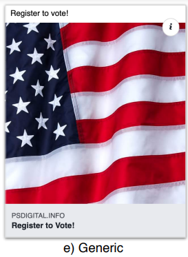
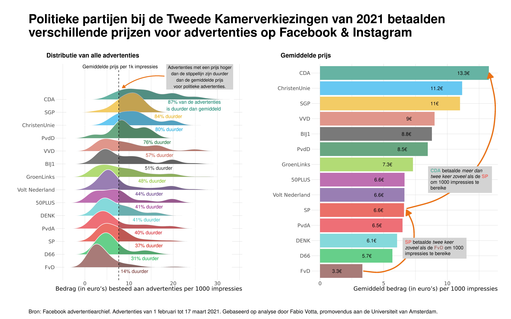
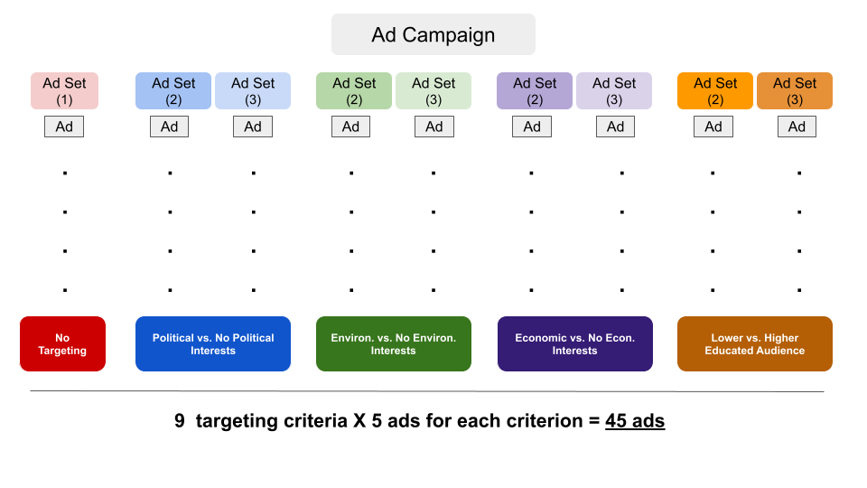
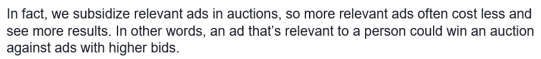

layout: true
    
<div class="logo"></div> 


```{r setup, include=FALSE}
# Here you can place global options for the entire document.
# Mostly used for knitr settings, but can also load data etc.
# Whatever happens here will not show in the presentation.
knitr::opts_chunk$set(fig.retina = 3, 
                      warning = FALSE, 
                      message = FALSE,
                      echo = F)


library(tidyverse)

source("../algo_ads/helpers.R")

# dir("../img", recursive = T, full.names = T) %>%
#   walk(~{file.copy(.x, str_remove(.x, "\\.\\.\\/"))})
```


---

### The "bad actor"-story of political microtargeting

--

+ Discourse on political microtargeting is often focused on the "bad actor" story

  + Russian election interference campaign (Internet Research Agency)
  
  + Cambridge Analytica scandal
  
  + Target specific groups with the intention to manipulate/dissuade from voting

--


+ The implicit assumption:
  
    + advertisers have strong control over who sees which ad 

--

<br>

**But who ultimately decides to whom an ad is delivered to?**

> The ad delivery algorithm

---

class: 

### Ad delivery algorithms

Meta says:

> *The Facebook ad delivery system uses an **ad auction** and **machine learning** to determine where, when and to whom we show your ads. These processes work together to maximize value for both people and businesses.*

--

+ Ad auctions

  + Each time there's an opportunity to show an ad to someone, an auction takes place to determine which ad to show to that person. 

--
  
&#8594; **More about that later**
  
--


+ Machine learning

  + Models trained on internal platform data to deliver ads to the  *"right"* audience

---


### Prior Research into Ad Delivery Algorithms

**Job ads and Housing**

* Discrimination in Online Ad Delivery [(Sweeney, 2013)](https://doi.org/10.1145/2460276.2460278) 

* Algorithmic bias? An empirical study of apparent gender-based discrimination in the display of stem career ads [(Lambrecht and Tucker, 2019)](https://doi.org/10.1287/mnsc.2018.3093) 

* Auditing Race and Gender Discrimination in Online Housing Market [(Asplund et al., 2020)](https://ojs.aaai.org/index.php/ICWSM/article/view/7276) 

* Auditing for Discrimination in Algorithms Delivering Job Ads [(Imana et al., 2021)](https://ant.isi.edu/datasets/addelivery/Discrimination-Job-Ad-Delivery.pdf) 

--

**More general and political ads**

* Discrimination through Optimization: How Facebook’s Ad Delivery Can Lead to Biased Outcomes
 [(Ali et al. 2020)](https://dl.acm.org/doi/10.1145/3359301)

* Ad Delivery Algorithms: The Hidden Arbiters of Political Messaging [(Ali et al., 2021)](https://dl.acm.org/doi/pdf/10.1145/3437963.3441801) 

---

class: white

### Prior Research (Ali et al., 2020,2021)

.pull-left[

]


.pull-right[

]


---

### Prior Research (Ali et al., 2020,2021)


When targeting the same audience, at the same time, with the same budget:

+ Ad delivery is heavily skewed along gendered and racial stereotypes
  + even without the intent of the advertiser [(Ali et al. 2020)](https://dl.acm.org/doi/10.1145/3359301)
  
--

.pull-left[
**Delivery remains skewed even with blank image**

Images invisible to humans but still detectable by algorithm:

+ yield **similar skews** in delivery

+ highlights importance of algorithm

+ less based on differences in user behavior/preferences
]

.pull-right[

]


---


### Prior Research (Ali et al., 2020,2021)


When targeting the same audience, at the same time, with the same budget:

Regarding political ads [(Ali et al., 2021)](https://dl.acm.org/doi/pdf/10.1145/3437963.3441801):

--

.pull-left[
+ **Skewed delivery**

  + Political ads more often delivered to ideologically congruent audience 
      + Bernie ads → higher % D; 
      + Trump ads → higher % R

+ **Increased cost**

  + Liberal ad to a liberal audience: *21 Dollar per 1000 users*; 
  + Conservative ad delivered to liberal audience: *40 Dollar per 1000 users*.
]

--

.pull-right[
**Results hold** 

+ when tricking Facebook into classifying non-partisan ads as partisan



]


---


### How are ad costs determined?

**Ad auctions**

--

Each time there is a possibility to show an ad, an ad auction takes place.

--

The winner of the auction is determined by *bids* and *ad relevance*:

--

+ *Bid:* 

  + what the advertiser is willing to pay 

--

+ *Ad relevance:* 

  + predicated probability that delivery leads to desired outcome (e.g. clicks, views)
  
      + when audiences find ads "engaging, interesting or eye-catching"

  + conforming to FB quality standards (e.g. no clickbait)


---

### Political Microtargeting and Ad Delivery Algorithms


+ Severely limiting or banning microtargeting is *inadequate*

It would:

1. not end “targeting”

2. give more “autonomy” to the platform and its ad delivery algorithm

3. would make it more difficult to create transparency

<br>

→ *regulations that only focus on the advertiser “capabilities” and not also the ad delivery algorithm falls short*

---


class: white




---


class: center, middle

## Research Question

### How does the Facebook ad delivery algorithm<br>influence the pricing & distribution of political ads<br>in the Netherlands?

---

class: center, middle

# Research Design

---

### Research Design

+ Collaborate with Dutch parties to place political ads

+ We reached out to 7 major political parties

  + final collaboration with 3: GroenLinks, VVD and PvdA
  
--

<br>
  
+ Experimental design that varies targeting criteria (and parties)

+ Place ads from 1st to 8th Feburary 2022

  + close but not too close to Netherlands-wide local elections in March 16th 2022

--
  
<br>
  
+ Pre-registered research design and hypotheses

---


### Dependent Variables

+ Price per 1k users reached

  + this measure is an industry standard

+ Delivery of ads 

  + Audience shares measured by % of ads delivered to specific group
  
      + Gender
  
      + Age
    
      + Region
  
      + Targeting criteria


---


### Dependent Variables

The study design incorporates two *levels of comparisons*

Observing differences of pricing and delivery:

  1. *within a party* (i.e. different targeting criteria)

  2. *between parties*
  
---


### Independent Variable: Ad Relevance

We theorize two different but possibly overlapping levels of (predicted) relevance:

--

1. *Relevant audience for ad content (i.e. political message)*

--

  + Political message likely to be relevant for people interested in politics

--

2. *Relevant audience for party (i.e. source of ad)*

--

  + Ads from an environmentalist party more likely to be relevant for audience interested in environmentalism.

--

**Hypotheses:**

> H1: The more relevant an audience is for an ad, the cheaper is the cost for reaching 1000 users in that audience.

> H2: The more relevant an audience is for an ad, the more are ads delivered to that audience.


---


### Targeting criteria

We used 9 different targeting criteria for our advertisements

.pull-left[

1. Political interests
2. Excluding political interest


]

.pull-right[

**Relevant audience for ad content**

> Targeting political ads to audiences who are interested in politics 

> + H1a) *is less expensive* 

> + H2a) *deliver more* 

> than targeting audiences who are not interested in politics. 


]


---

### Targeting criteria


We used 9 different targeting criteria for our advertisements

.pull-left[

1. Political interests
2. Excluding political interest
  

<ol start="3">
  <li>Higher educated audience</li>
  <li>Lower educated audience</li>
</ol>


]

.pull-right[

**Relevant audience for ad content**

> Targeting political ads to higher-educated audiences

> + H1b) *is less expensive* 

> + H2b) *deliver more* 

> than targeting lower-educated audiences. 


]


---

### Targeting criteria


We used 9 different targeting criteria for our advertisements

.pull-left[

1. Political interests
2. Excluding political interest

<ol start="3">
  <li>Higher educated audience</li>
  <li>Lower educated audience</li>
</ol>


]

.pull-right[


**Relevant audience for party**


> Targeting political ads to higher-educated audiences

> + H1c) *is less expensive* 

> + H2c) *deliver more* 

for GroenLinks compared to the PvdA and VVD. 

]


---

### Targeting criteria


We used 9 different targeting criteria for our advertisements

.pull-left[

1. Political interests
2. Excluding political interest
  
  
<ol start="3">
  <li>Higher educated audience</li>
  <li>Lower educated audience</li>
</ol>

<ol start="5">
  <li>Environmental interests</li>
  <li>Excluding environmental interests</li>
</ol>

  

]

.pull-right[


**Relevant audience for party**


> Targeting political ads to audiences interested in environenmentalism

> + H1d) *is less expensive* 

> + H2d) *deliver more* 

for GroenLinks compared to the PvdA and VVD. 

]


---


### Targeting criteria


We used 9 different targeting criteria for our advertisements

.pull-left[

1. Political interests
2. Excluding political interest
  
<ol start="3">
  <li>Higher educated audience</li>
  <li>Lower educated audience</li>
</ol>

<ol start="5">
  <li>Environmental interests</li>
  <li>Excluding environmental interests</li>
</ol>

<ol start="7">
  <li>Economic interests</li>
  <li>Excluding Economic interests</li>
</ol>

]

.pull-right[


**Relevant audience for party**


> Targeting political ads to audiences interested in the economy

> + H1e) *is less expensive* 

> + H2e) *deliver more* 

for VVD compared to the PvdA and GroenLinks. 

]


---


### Targeting criteria


We used 9 different targeting criteria for our advertisements

.pull-left[

1. Political interests
2. Excluding political interest

<ol start="3">
  <li>Higher educated audience</li>
  <li>Lower educated audience</li>
</ol>

<ol start="5">
  <li>Environmental interests</li>
  <li>Excluding environmental interests</li>
</ol>

<ol start="7">
  <li>Economic interests</li>
  <li>Excluding Economic interests</li>
</ol>
  
<ol start="9">
  <li>No Targeting</li>
</ol>

]

.pull-right[

We expect that the Meta ad delivery algorithm has an easier time finding a relevant audience for parties that have more support in the public.


> H3a: Parties with a greater share of supporters pay less for reaching 1000 users.

> H3b: Parties with a greater share of supporters reach more people than smaller parties.

]

---

class: white

### Targeting Criteria and Relevance Coding


---

class: white

### Design Overview

+ We determined the minimum number of ads we need per condition and that is *5* 

   + 9 conditions * 5 ads = 45 ads per party (135 in total)

<center>

</center>


---


### Research design

.pull-left[
<style type="text/css">
.tg  {border-collapse:collapse;border-color:#ccc;border-spacing:0;}
.tg td{background-color:#fff;border-color:#ccc;border-style:solid;border-width:1px;color:#333;
  font-family:Arial, sans-serif;font-size:14px;overflow:hidden;padding:10px 5px;word-break:normal;}
.tg th{background-color:#f0f0f0;border-color:#ccc;border-style:solid;border-width:1px;color:#333;
  font-family:Arial, sans-serif;font-size:14px;font-weight:normal;overflow:hidden;padding:10px 5px;word-break:normal;}
.tg .tg-5otb{border-color:inherit;color:#656565;text-align:left;vertical-align:top}
.tg .tg-kdu2{background-color:#b4a7d5;border-color:inherit;text-align:left;vertical-align:top}
.tg .tg-ckur{background-color:#ffffff;border-color:inherit;color:#32cb00;text-align:left;vertical-align:top}
.tg .tg-fbme{background-color:#ffffff;border-color:inherit;color:#036400;text-align:left;vertical-align:top}
.tg .tg-7vhs{background-color:#dbd3e7;border-color:inherit;text-align:left;vertical-align:top}
.tg .tg-0pky{border-color:inherit;text-align:left;vertical-align:top}
.tg .tg-r3xs{background-color:#b6d7a9;border-color:inherit;text-align:left;vertical-align:top}
.tg .tg-ugdo{background-color:#ffffff;border-color:inherit;color:#fe0000;text-align:left;vertical-align:top}
.tg .tg-ko5t{background-color:#d8ead2;border-color:inherit;text-align:left;vertical-align:top}
.tg .tg-ry9a{background-color:#ffffff;border-color:inherit;color:#656565;text-align:left;vertical-align:top}
.tg .tg-c6of{background-color:#ffffff;border-color:inherit;text-align:left;vertical-align:top}
.tg .tg-pvqo{background-color:#fe9900;border-color:inherit;text-align:left;vertical-align:top}
.tg .tg-sdck{background-color:#f9cc9a;border-color:inherit;text-align:left;vertical-align:top}
.tg .tg-9d5r{background-color:#a5c1f4;border-color:inherit;text-align:left;vertical-align:top}
.tg .tg-lfef{background-color:#cbdafb;border-color:inherit;text-align:left;vertical-align:top}
</style>
<table class="tg">
<thead>
  <tr>
    <th class="tg-0pky">Targeting</th>
    <th class="tg-0pky">GroenLinks</th>
    <th class="tg-0pky">PvdA</th>
    <th class="tg-0pky">VVD</th>
    <th class="tg-0pky"></th>
  </tr>
</thead>
<tbody>
  <tr>
    <td class="tg-0pky">1. No Targeting</td>
    <td class="tg-5otb">o</td>
    <td class="tg-5otb">o</td>
    <td class="tg-5otb">o</td>
    <td class="tg-0pky"></td>
  </tr>
  <tr>
    <td class="tg-r3xs">2. Environmental interests</td>
    <td class="tg-fbme">+</td>
    <td class="tg-ugdo">-</td>
    <td class="tg-ugdo">-</td>
    <td class="tg-r3xs"></td>
  </tr>
  <tr>
    <td class="tg-ko5t">3. Excluding environmental interests</td>
    <td class="tg-ugdo">-</td>
    <td class="tg-ry9a">o</td>
    <td class="tg-ry9a">o</td>
    <td class="tg-ko5t"></td>
  </tr>
  <tr>
    <td class="tg-kdu2">4. Economic interests</td>
    <td class="tg-c6of">-</td>
    <td class="tg-c6of">-</td>
    <td class="tg-c6of">+</td>
    <td class="tg-kdu2"></td>
  </tr>
  <tr>
    <td class="tg-7vhs">5. Excluding Economic interests</td>
    <td class="tg-c6of">o</td>
    <td class="tg-c6of">o</td>
    <td class="tg-c6of">-</td>
    <td class="tg-7vhs"></td>
  </tr>
  <tr>
    <td class="tg-pvqo">6. Higher-educated people</td>
    <td class="tg-ckur">++</td>
    <td class="tg-ckur">+</td>
    <td class="tg-ckur">+</td>
    <td class="tg-pvqo"></td>
  </tr>
  <tr>
    <td class="tg-sdck">7. Lower-educated people</td>
    <td class="tg-ugdo">--</td>
    <td class="tg-ugdo">-</td>
    <td class="tg-ugdo">-</td>
    <td class="tg-sdck"></td>
  </tr>
  <tr>
    <td class="tg-9d5r">8. Political interests</td>
    <td class="tg-ckur">+</td>
    <td class="tg-ckur">+</td>
    <td class="tg-ckur">+</td>
    <td class="tg-9d5r"></td>
  </tr>
  <tr>
    <td class="tg-lfef">9. Excluding political interests</td>
    <td class="tg-ugdo">-</td>
    <td class="tg-ugdo">-</td>
    <td class="tg-ugdo">-</td>
    <td class="tg-lfef"></td>
  </tr>
</tbody>
</table>
]

.pull-right[


]


---

### Research Design

Facebook says it delivers ads based on a "relevance" score

→ Facebook optimizes for ***perceived*** *match* between the content/message of the ad and the person seeing the ad

We hypothesize some audiences might therefore be *harder to reach*
  + as in: more expensive
  + reach less people given the same conditions (budget and timing)
  

  
--

In order to test the algorithm we need to:

+ Place ads with ad goal: *Reach*
+ Ad optimization: *Unique users reached*

--

Optimizing on Reach (rather than Traffic): 
   
+ the algorithm has to work more on its internal assumptions 
+ doesn't use user cues (i.e. clicks) as much to decide who is going to see the ad

---

class: center, middle

# Ad Creative and Setup


---

## Ad Creative and Setup

+ Infos about the election and how to vote from the *Rijksoverheid*

+ Official Get-Out-To-Vote campaign "Elke Stem Telt" for local elections

+ Selected *Five* Images from campaign that we would like to run

<br>


+ https://www.kiesraad.nl/verkiezingen/gemeenteraden

---

## Ad Images (1 and 2 out of 5)

.pull-left[


]


.pull-right[


]


---


## Ad Images (3 and 4 out of 5)

.pull-left[


]


.pull-right[


]


---

## Ad Images (5 out of 5)


.pull-left[


]


---

## How the ad looked like on Desktop


<p style="clear: both;">


---

## How the ad looked like on Desktop


---

## How the ad looked like on Desktop


---


class: center, middle

## Results

---

class: white

### Descriptives


--

.pull-left[

```{r, echo=F}
overview <- readRDS("data/overview.rds")

share_dat <- overview %>% 
  drop_na(ad_name) %>%
  # set_names(names(overview_uva)) %>% 
  mutate(pair = readr::parse_number(ad_set_name)) %>% 
  mutate(comparison = case_when(
    str_detect(ad_name, "Economy") ~ "Economy",
    str_detect(ad_name, "Environment") ~ "Environment",
    str_detect(ad_name, "Education") ~ "Education",
    str_detect(ad_name, "Politics") ~ "Politics",
    T ~ NA_character_
  )) %>% 
  drop_na(comparison) %>% 
  # count(ad_name)
  group_by(pair, comparison, party) %>% 
  mutate(total = sum(reach),
         share = reach/total*100) %>% 
  ungroup()

overview %>% #filter(is.na(targeting))
  drop_na(targeting) %>% 
  # filter(targeting == "No Targeting") %>%
  mutate(party = fct_relevel(party, c("PvdA", "GroenLinks", "VVD"))) %>% 
  ggplot(aes(party, cost_per_1_000_people_reached)) + # Move y and x here so than they can be used in stat_*
  geom_jitter(width = 0.2) +
  geom_boxplot(aes(color = party), width = 0.2) +
  # stat_summary(aes(color = party), fun = mean, fun.min = mean, fun.max = mean,
  #              geom = "crossbar", width = 0.5) +
  scale_color_parties() +
  theme_minimal() +
  theme(legend.position = "none", plot.title = element_text(size = 19, face = "bold")) +
  # ggpubr::stat_compare_means() +
  EnvStats::stat_mean_sd_text(digits = 2) +
  labs(y = "Cost per 1000 users reached\nin Euros (across all conditions)", x = "Party", title = "Cost per 1000 users\n") 
```

]

--

.pull-right[

```{r, echo=F}

overview %>% 
  drop_na(targeting) %>% 
  # filter(targeting == "No Targeting") %>%
  mutate(party = fct_relevel(party, c("PvdA", "GroenLinks", "VVD"))) %>% 
  ggplot(aes(party, reach)) + # Move y and x here so than they can be used in stat_*
  geom_jitter(width = 0.2) +
  geom_boxplot(aes(color = party), width = 0.2) +
  # stat_summary(aes(color = party), fun = mean, fun.min = mean, fun.max = mean,
  #              geom = "crossbar", width = 0.5) +
  scale_color_parties() +
  theme_minimal() +
  theme(legend.position = "none", plot.title = element_text(size = 19, face = "bold")) +
  # ggpubr::stat_compare_means() +
  EnvStats::stat_mean_sd_text(digits = 0) +
  labs(y = "Reach (across all conditions)", x = "Party", title = "Reach (unique people)\n") 
```


]


---


class: white

## Hypothesis H3

.pull-left[

H3a: Parties with a greater share of supporters pay less for reaching 1000 users. 


```{r}
mod_nobreak_h3a <- lm(cost_per_result ~ party + engagement, data = overview %>% filter(targeting == "No Targeting"))
# lm.beta::lm.beta(mod)

    
sjPlot::plot_model(mod_nobreak_h3a, show.values = T, show.p = T) +
  theme_minimal() +
  geom_hline(yintercept = 0, linetype = "dashed") +
  ylim(-0.13, 0.05) +
  ggtitle("Cost per 1000 users") +
  theme(plot.title = element_text(size = 19, face = "bold")) 
```

]

--

.pull-right[

H3b: Parties with a greater share of supporters pay less for reaching 1000 users. 


```{r}
mod_nobreak_h3b <- lm(reach ~ party + engagement, overview %>% filter(targeting == "No Targeting"))
# lm.beta::lm.beta(mod)

    
sjPlot::plot_model(mod_nobreak_h3b, show.values = T, show.p = T) +
  theme_minimal() +
  geom_hline(yintercept = 0, linetype = "dashed") +
  # ylim(-0.13, 0.05) +
  ggtitle("Reach") +
  theme(plot.title = element_text(size = 19, face = "bold")) 
```
]


---

## Hypothesis H1 and H2

.pull-left[

> H1: The more relevant an audience is for an ad, the cheaper is the cost for reaching 1000 users in that audience.

```{r}
# overview %>%
#   filter(targeting != "No Targeting") %>% 
#   ggplot(aes(relevance, cost_per_1_000_people_reached)) +
#   geom_jitter(aes(color = party)) +
#   geom_smooth(method = "lm") +
#   ggpubr::stat_cor() 
# 
# mo <- lm(cost_per_result ~ party + targeting + relevance, data = overview %>% filter(targeting != "No Targeting")) 
# 
# sjPlot::plot_model(mo, show.p = T, show.values = T, sort.est = T, type = "std")
# 
# yo <- lm.beta::lm.beta(mo)
# # yo %>% summary(standardized = T)
# summary(yo, standardized = T)
# 
# broom::tidy(yo)

stargazer::stargazer(lm(cost_per_result ~ party + targeting, data = overview %>% filter(targeting != "No Targeting")),
                # lm(cost_per_result ~ targeting + relevance, data = overview %>% filter(targeting != "No Targeting")),
                # lm(cost_per_result ~ party + targeting, data = overview %>% filter(targeting != "No Targeting")),
                lm(cost_per_result ~ party + targeting + relevance, data = overview %>% filter(targeting != "No Targeting")),
                type = "html")
```
]


```{r}
# library(lme4)
# 
# summary(mod <- lm(cost_per_result ~  + engagement, data = overview %>%
#                     filter(targeting != "No Targeting")))
# 
# sjPlot::plot_model(mod, show.p = T, show.values = T, type = "std")# +
```

.pull-right[

> H2: The more relevant an audience is for an ad, the more are ads delivered to that audience.


```{r, results='asis'}
mod_nobreak_h2 <- lm(share ~ relevance + engagement, data = share_dat %>% 
  filter(targeting != "No Targeting"))
# lm.beta::lm.beta(mod)

# texreg::htmlreg(mod_nobreak_h2)
# texreg::screenreg(mod_nobreak_h2)


# sjPlot::plot_model(mod_nobreak_h2, show.p = T, show.values = T)

# share_dat %>%
#   filter(targeting != "No Targeting") %>%
#   ggplot(aes(relevance, share, color = party)) +
#   geom_jitter() +
#   geom_smooth(method = "lm")
# 
# 
# share_dat %>% 
#   filter(targeting != "No Targeting") %>% 
#   ggplot(aes(party, share)) +
#   geom_boxplot()
#   geom_point()

stargazer::stargazer(lm(share ~ party + targeting, data = share_dat %>% filter(targeting != "No Targeting")),
                # lm(share ~ targeting + relevance, data = overview %>% filter(targeting != "No Targeting")),
                # lm(share ~ party + targeting, data = overview %>% filter(targeting != "No Targeting")),
                lm(share ~ party + targeting + relevance, data = share_dat %>% filter(targeting != "No Targeting")),
                type = "html")

```
]

---

## H1a,H2a and H1a,H1b

.pull-left[


```{r, results='asis'}
mod_nobreak_h1ab <- lm(cost_per_result ~ targeting + engagement + party, data = overview)
# lm.beta::lm.beta(mod)


# texreg::screenreg(mod_nobreak_h1ab)


```

```{r}
library(parameters)
library(modelbased)

contrasts_nobreak_h1ab <- estimate_contrasts(mod_nobreak_h1ab, contrast = c("targeting"),
                                at = c("targeting")) %>% 
  as.data.frame()  %>%  
  mutate(Contrast = paste(Level1, "-", Level2)) %>%  
  mutate(condition_comparison = fct_reorder(Contrast, Difference)) 

contrasts_nobreak_h1ab %>% 
  as_tibble()  %>% 
  # filter(str_detect(Level1, "Environment excluded") & !str_detect(Level2, "Environment excluded")) %>% 
  filter(
    # str_count(condition_comparison, "Environment") == 2 |
    # str_count(condition_comparison, "Economy") == 2 
    str_count(condition_comparison, "Politics") == 2 |
    str_count(condition_comparison, "Education") == 2 
  ) %>% 
  # in case the comparison is in wrong direction, change around
  mutate_at(vars(Difference, CI_low, CI_high), ~ifelse(str_detect(Level1, "excluded"), .x*-1, .x)) %>%
  mutate_at(vars(Difference, CI_low, CI_high), ~ifelse(str_detect(Level1, "Low"), .x*-1, .x)) %>%
  mutate(plabel = get_plabs(p)) %>% 
  mutate(diff_label = paste0(round(Difference, 3), plabel)) %>%
  # mutate(condition_comparison = ifelse(
  #   condition_comparison == "Entertainment - Politics",
  #   "Price of politics audience vs.\nentertainment audience",
  #   "Price of high-education audience vs.\nlow-education audience"
  #   )) %>% 
  ggplot(aes("", Difference)) + 
  geom_point() +
  geom_errorbar(aes(ymin = CI_low, ymax = CI_high), width = 0) +
  coord_flip() +
  geom_text(aes(label = diff_label), nudge_x = 0.1) +
  geom_hline(yintercept = 0, linetype = "dashed") +
  labs(y = "Estimated price differences of reaching 1k users in Euro",
       x = "Condition Comparisons") +
  theme_minimal() +
  scale_color_parties() +
  theme(legend.position = "none")  +
  # facet_grid(condition_comparison ~ ., scales= "free_y" ) +
  facet_wrap(~condition_comparison, ncol = 1, scales= "free_y" ) +
  theme(legend.position = "bottom",
        strip.text.y = element_blank(), 
        strip.background = element_rect(fill = "lightgrey")) 


```


]

.pull-right[
```{r, results='asis'}
mod_nobreak_h2ab <- lm(share ~ targeting + party + engagement, data = share_dat)
# lm.beta::lm.beta(mod)


# texreg::htmlreg(mod_nobreak_h2ab)

# texreg::screenreg(mod_nobreak_h2ab)

# sjPlot::plot_model(mod_nobreak_h2ab, show.p = T, show.values = T)
```


```{r}
contrasts_nobreak_h2ab <- estimate_contrasts(mod_nobreak_h2ab, contrast = c("targeting"),
                                at = c("targeting")) %>% 
  as.data.frame()  %>%  
  mutate(Contrast = paste(Level1, "-", Level2)) %>%  
  mutate(condition_comparison = fct_reorder(Contrast, Difference)) 

contrasts_nobreak_h2ab %>% 
  as_tibble()  %>% 
  # filter(str_detect(Level1, "Environment excluded") & !str_detect(Level2, "Environment excluded")) %>% 
  filter(
    # str_count(condition_comparison, "Environment") == 2 |
    # str_count(condition_comparison, "Economy") == 2 
    str_count(condition_comparison, "Politics") == 2 |
    str_count(condition_comparison, "Education") == 2 
  ) %>% 
  # in case the comparison is in wrong direction, change around
  mutate_at(vars(Difference, CI_low, CI_high), ~ifelse(str_detect(Level1, "excluded"), .x*-1, .x)) %>%
  mutate_at(vars(Difference, CI_low, CI_high), ~ifelse(str_detect(Level1, "Low"), .x*-1, .x)) %>%
  mutate(plabel = get_plabs(p)) %>% 
  mutate(diff_label = paste0(round(Difference, 2), plabel)) %>%
  # mutate(condition_comparison = ifelse(
  #   condition_comparison == "Entertainment - Politics",
  #   "Price of politics audience vs.\nentertainment audience",
  #   "Price of high-education audience vs.\nlow-education audience"
  #   )) %>% 
  ggplot(aes("", Difference)) + 
  geom_point() +
  geom_errorbar(aes(ymin = CI_low, ymax = CI_high), width = 0) +
  coord_flip() +
  geom_text(aes(label = diff_label), nudge_x = 0.1) +
  geom_hline(yintercept = 0, linetype = "dashed") +
  labs(y = "Estimated price differences of reaching 1k users in Euro",
       x = "Condition Comparisons") +
  theme_minimal() +
  scale_color_parties() +
  theme(legend.position = "none")  +
  # facet_grid(condition_comparison ~ ., scales= "free_y" ) +
  facet_wrap(~condition_comparison, ncol = 1, scales= "free_y" ) +
  theme(legend.position = "bottom",
        strip.text.y = element_blank(), 
        strip.background = element_rect(fill = "lightgrey")) 


```


]


---


## H1(2)c, H1(2)d, H1(2)e


.pull-left[
```{r, results='asis'}
mod_nobreak_h1cg <- lm(cost_per_result ~ targeting * party + engagement, data = overview)
# lm.beta::lm.beta(mod)


# texreg::screenreg(mod_nobreak_h1cg)
```


```{r}
contrasts_nobreak_h1cg <- estimate_contrasts(mod_nobreak_h1cg, contrast = c("targeting", "party"),
                                at = c("targeting", "party")) %>% 
  as.data.frame()  %>%  
  mutate(Contrast = paste(Level1, "-", Level2)) %>%  
  mutate(condition_comparison = fct_reorder(Contrast, Difference)) 

contrasts_nobreak_h1cg %>% 
  as_tibble()  %>% 
  # filter(str_detect(Level1, "Environment excluded") & !str_detect(Level2, "Environment excluded")) %>% 
  filter(
    str_count(condition_comparison, "PvdA") == 2 |
    str_count(condition_comparison, "GroenLinks") == 2 |
    str_count(condition_comparison, "VVD") == 2
  ) %>% 
  filter(
    str_count(condition_comparison, "Environment") == 2 |
    str_count(condition_comparison, "Economy") == 2 |
    # str_count(condition_comparison, "Politics") == 2 |
    str_count(condition_comparison, "Education") == 2
  ) %>%
  mutate(party = str_extract(condition_comparison, "VVD|GroenLinks|PvdA")) %>% 
  mutate(condition_comparison = str_remove_all(condition_comparison, "VVD|GroenLinks|PvdA")) %>% 
  # in case the comparison is in wrong direction, change around
  mutate_at(vars(Difference, CI_low, CI_high), ~ifelse(str_detect(Level1, "excluded"), .x*-1, .x)) %>%
  mutate_at(vars(Difference, CI_low, CI_high), ~ifelse(str_detect(Level1, "Low"), .x*-1, .x)) %>%
  mutate(plabel = get_plabs(p)) %>% 
  mutate(diff_label = paste0(round(Difference, 2), plabel)) %>%
  # mutate(condition_comparison = ifelse(
  #   condition_comparison == "Entertainment - Politics",
  #   "Price of politics audience vs.\nentertainment audience",
  #   "Price of high-education audience vs.\nlow-education audience"
  #   )) %>% 
  ggplot(aes("", Difference, color = party)) + 
  geom_point(position = position_dodge(width = 0.9)) +
  geom_errorbar(aes(ymin = CI_low, ymax = CI_high), width = 0, position = position_dodge(width = 0.9)) +
  geom_text(aes(label = diff_label, y = Difference + 0.1), position = position_dodge(width = 0.9), show.legend = F) +
  coord_flip() +
  geom_hline(yintercept = 0, linetype = "dashed") +
  labs(y = "Estimated price differences of reaching 1k users in Euro",
       x = "Condition Comparisons") +
  theme_minimal() +
  scale_color_parties() +
  # facet_grid(condition_comparison ~ ., scales= "free_y" ) +
  facet_wrap(~condition_comparison, ncol = 1, scales= "free_y" ) +
  theme(legend.position = "bottom",
        strip.text.y = element_blank(), 
        strip.background = element_rect(fill = "lightgrey")) 
```


]

.pull-right[


```{r, results='asis'}
mod_nobreak_h2cg <- lm(share ~ targeting * party + engagement, data = share_dat)
# lm.beta::lm.beta(mod)


```


```{r}
contrasts_nobreak_h2cg <- estimate_contrasts(mod_nobreak_h2cg, contrast = c("targeting", "party"),
                                at = c("targeting", "party")) %>% 
  as.data.frame()  %>%  
  mutate(Contrast = paste(Level1, "-", Level2)) %>%  
  mutate(condition_comparison = fct_reorder(Contrast, Difference)) 

contrasts_nobreak_h2cg %>% 
  as_tibble()  %>% 
  # filter(str_detect(Level1, "Environment excluded") & !str_detect(Level2, "Environment excluded")) %>% 
  filter(
    str_count(condition_comparison, "PvdA") == 2 |
    str_count(condition_comparison, "GroenLinks") == 2 |
    str_count(condition_comparison, "VVD") == 2
  ) %>% 
  filter(
    str_count(condition_comparison, "Environment") == 2 |
    str_count(condition_comparison, "Economy") == 2 |
    # str_count(condition_comparison, "Politics") == 2 |
    str_count(condition_comparison, "Education") == 2
  ) %>%
  mutate(party = str_extract(condition_comparison, "VVD|GroenLinks|PvdA")) %>% 
  mutate(condition_comparison = str_remove_all(condition_comparison, "VVD|GroenLinks|PvdA")) %>% 
  # in case the comparison is in wrong direction, change around
  mutate_at(vars(Difference, CI_low, CI_high), ~ifelse(str_detect(Level1, "excluded"), .x*-1, .x)) %>%
  mutate_at(vars(Difference, CI_low, CI_high), ~ifelse(str_detect(Level1, "Low"), .x*-1, .x)) %>%
  mutate(plabel = get_plabs(p)) %>% 
  mutate(diff_label = paste0(round(Difference, 2), plabel)) %>%
  # mutate(condition_comparison = ifelse(
  #   condition_comparison == "Entertainment - Politics",
  #   "Price of politics audience vs.\nentertainment audience",
  #   "Price of high-education audience vs.\nlow-education audience"
  #   )) %>% 
  ggplot(aes("", Difference, color = party)) + 
  geom_point(position = position_dodge(width = 0.9)) +
  geom_errorbar(aes(ymin = CI_low, ymax = CI_high), width = 0, position = position_dodge(width = 0.9)) +
  geom_text(aes(label = diff_label, y = Difference + 2.5), position = position_dodge(width = 0.9), show.legend = F) +
  coord_flip() +
  geom_hline(yintercept = 0, linetype = "dashed") +
  labs(y = "Estimated share of delivery differences in percent",
       x = "Condition Comparisons") +
  theme_minimal() +
  scale_color_parties() +
  # facet_grid(condition_comparison ~ ., scales= "free_y" ) +
  facet_wrap(~condition_comparison, ncol = 1, scales= "free_y" ) +
  theme(legend.position = "bottom",
        strip.text.y = element_blank(), 
        strip.background = element_rect(fill = "lightgrey")) 


```


]


---


## Gender differences


---

## Age differences


---

## Region differences


---

## Platform differences


---

## Weird stuff?


---

## Open questions

---


class: center, middle

## Pre-Test

### Very (!) early results

---

## Pre-Test


Place 30 ads on Facebook for 7 days

+ No targeting (18+, all genders, all of Netherlands)
+ Target high-educated audience
+ Target low-educated audience

Daily budget: 1 Euro 

Reached: 61,137 people

---

class: white

## Cost per 1k Users


---

class: white


## Cost per 1k Users


---

class: white

## Cost per age group


---

class: white

## Cost per age group


---


class: white

## Skewed delivery in terms of gender

### Measurement for skew in delivery

*Example*

ad delivers to 50% women 

-> it would be wrong to think there is no skew 

--

because:

+ 60% of audience are women (last 30 days active)

--

so the skew is:

+ skew = gender share in delivery - gender share in audience

> 50-60 = -10%

Ad delivered to 10% less women than if we would assume no skew

---

class: white

## Skewed delivery in terms of gender

+ skew = gender share in delivery - gender share in audience (last 30 days active)


---

class: white

## Less clear for age groups

+ skew = age share in delivery - age share in audience


---


<br>
<br>
<br>

<center>


<!--  -->

</center>


---

class: center, middle

# Let's discuss


---

class: white

### What determines delivery and costs?


.pull-left[

**Ad auctions**

Each time there is a possibility to show an ad, an ad auction takes place.

The winner of the auction is determined by

1.) *bids*

2.) *ad relevance*


]

.pull-right[
```{r, echo = F}
nomnoml::nomnoml("#direction: right
[Bid|what the advertiser is willing to pay, i.e. the budget]->[Price]
[Ad relevance|1.) predicated probability that showing ad leads to desired outcome (e.g. clicks, views)
2.) conforming to quality standards (e.g. no clickbait)]
[Ad relevance]->[Price]")

```
]


---


class: center, middle

## Poltical Microtargeting since 2016

--

Ad libraries and **limitations to targeting**


---

### Poltical Microtargeting since 2016

**Google** now only allows targeting by age, gender and location for political ads.

**Facebook** also limited ad targeting options 
  + disallowing targeting based on race, religion and more
  
--
  
.pull-left[
```{r, out.width="160%", echo = F}
knitr::include_graphics("img/remove_targeting.png")
```
]

.pull-right[
<br>
<br>
<br>
[facebook.com/business/news/removing-certain-ad-targeting-options-and-expanding-our-ad-controls](https://www.facebook.com/business/news/removing-certain-ad-targeting-options-and-expanding-our-ad-controls)
]


---


### Poltical Microtargeting since 2016

**Google** now only allows targeting by age, gender and location for political ads.

**Facebook** also limited ad targeting options 
  + disallowing targeting based on race, religion and more
  
<br>

Facebook still allows targeting based on:
  + detailed demographics 
  + users' declared interests 
  + Behavioural targeting 
  + Custom and Lookalike Audiences


---


class: center, middle

# Ad Objectives,<br>Optimizations<br>and Relevancy

---

### Ad Objectives, Optimizations and Relevancy

There is more than just targeting criteria that decides who sees political ads:

+ **Ad objective** = what is the goal of the ad?

    for example: generate web traffic, like Facebook page, buy products
    
--

+ **Optimization** = how should the goal be achieved?

    key metric to be optimized on: number of exposed users, clicks, conversions
    
--

+ **Relevancy** = how relevant is the ad to the user

```{r, out.width="70%", echo = F}

```

--

→ ***Implies big role of the ad delivery algorithm***


---

class: center, middle

## Prior investigations into the<br>role of the ad delivery algorithm

---

### Pricing differences in the US 2020 election

+ Biden campaign paid more than **6x more** 
  + compared to Trump campaign when targeting older voters. [(The Markup 2020)](https://themarkup.org/election-2020/2020/10/29/facebook-political-ad-targeting-algorithm-prices-trump-biden)
  
  
<center>
```{r, out.width="60%", echo = F}
knitr::include_graphics("img/older.png")
```
</center>
  
<!--  -->
  

---


### Why study black box of the Facebook algorithm


+ Facebook may (dis-)advantage certain parties

  + Equal-time rule?

--

+ Parties may pay more money to persuade potential voters

  + It might be more costly to reach people who are undecided

--

+ Political campaigns may not reach their intended audiences 

  + only the people that *already agree with the message*
  
  + certain groups might be excluded entirely
  
  + potentially exasperates the fragmentation of the political landscape


---

---

## Takeaways

---

